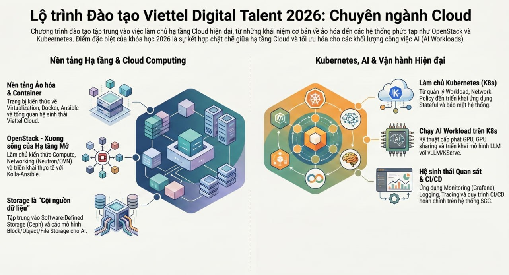

# VDT Cloud 2026 Training

## 1. Cloud Track Roadmap



## 2. Full-stack AI Cloud

```
┌──────────────────────────────────────────────────────────────────────────────────────────────┐
│  TẦNG SAAS (Software as a Service) - Dành cho End-User / AI App Developer                    │
│  - Viettel Playgrounds, Viettel Agent Builder (giao diện kéo thả phát triển Agent)           │
└───────────────────────────────┬──────────────────────────────────────────────────────────────┘
                                │ Gọi API / Sử dụng ứng dụng (Tương thích OpenAI SDK/LangChain)
┌───────────────────────────────▼──────────────────────────────────────────────────────────────┐
│  TẦNG PAAS (Platform as a Service) - Nền tảng điều phối AI & Vận hành Hiện đại               │
│  ──────────────────────────────────────────────────────────────────────────────────────────  │
│  [AI Serving & Pipelines Layer]                                                              │
│  - Viettel AI Inference (Triển khai LLM với vLLM / KServe)                                   │
│  - Viettel AI Pipelines (Kubeflow / Argo Workflows), Viettel Model Garden, Feature Store     │
│  ──────────────────────────────────────────────────────────────────────────────────────────  │
│  [Kubernetes & Container Core Layer] (Làm chủ K8s - Quản lý Workload, Stateful App)          │
│  - K8s AI Scheduling & Resource Optimization: KEDA, HAMi (GPU sharing), Volcano/Kueue        │
│  - K8s Networking & Security: Cilium / Calico, Network Policy, Bảo mật hệ thống              │
│  ──────────────────────────────────────────────────────────────────────────────────────────  │
│  [Hệ sinh thái Quan sát & CI/CD]                                                             │
│  - Toàn diện Observability: Metrics (Prometheus/Grafana), Logging (ELK), Tracing (Jaeger)    │
└───────────────────────────────┬──────────────────────────────────────────────────────────────┘
                                │ Cấp phát tài nguyên ảo hóa (VM Flavor, Block/Object Storage, OVN)
┌───────────────────────────────▼──────────────────────────────────────────────────────────────┐
│  TẦNG IAAS (Infrastructure as a Service) - Xương sống Hạ tầng Mở (Phần cứng & Ảo hóa)        │
│  ──────────────────────────────────────────────────────────────────────────────────────────  │
│  [Hạ tầng Quản lý & Ảo hóa - OpenStack] (Triển khai thực tế với Kolla-Ansible / Ansible)     │
│  - Nova (Compute KVM/QEMU), Neutron (Networking với OVN/OVS), Cinder (Storage management)    │
│  ──────────────────────────────────────────────────────────────────────────────────────────  │
│  [Software-Defined Storage - Cội nguồn dữ liệu]                                              │
│  - Ceph (Cung cấp các mô hình Block/Object/File Storage tối ưu riêng cho AI Workloads)       │
│  ──────────────────────────────────────────────────────────────────────────────────────────  │
│  [Hardware Vật lý] Máy chủ Bare Metal, Super Cluster, Card đồ họa NVIDIA H200, InfiniBand    │
└──────────────────────────────────────────────────────────────────────────────────────────────┘
```
