# 📘 Course Notes: InfiniBand Fundamentals for AI & NVIDIA Certifications

> Ghi chú học tập được tổng hợp từ slide "InfiniBand Fundamentals for AI & NVIDIA Certifications".

## Mục lục

1. [Vì sao cần mạng nhanh hơn?](#1-vì-sao-cần-mạng-nhanh-hơn)
2. [Analogy: Đường bộ vs Đường sắt cao tốc](#2-analogy-đường-bộ-vs-đường-sắt-cao-tốc)
3. [Lịch sử phát triển InfiniBand](#3-lịch-sử-phát-triển-infiniband)
4. [Kết nối InfiniBand tổng quan](#4-kết-nối-infiniband-tổng-quan)
5. [Kiến trúc phân lớp InfiniBand (Architecture Layers)](#5-kiến-trúc-phân-lớp-infiniband-architecture-layers)
6. [Phần cứng & phần mềm theo từng lớp](#6-phần-cứng--phần-mềm-theo-từng-lớp)
7. [Kết nối vật lý InfiniBand](#7-kết-nối-vật-lý-infiniband)
8. [Host Channel Adapter (HCA) & ConnectX](#8-host-channel-adapter-hca--connectx)
9. [Cáp kết nối (Cables)](#9-cáp-kết-nối-cables)
10. [Thực hành: Kết nối 2 node InfiniBand](#10-thực-hành-kết-nối-2-node-infiniband)
11. [InfiniBand Modules (Kernel Stack)](#11-infiniband-modules-kernel-stack)
12. [Subnet Manager (SM)](#12-subnet-manager-sm)
13. [GUID & LID](#13-guid--lid)
14. [Các công cụ chẩn đoán InfiniBand](#14-các-công-cụ-chẩn-đoán-infiniband)
15. [So sánh Ethernet vs InfiniBand](#15-so-sánh-ethernet-vs-infiniband)
16. [So sánh TCP/IP vs InfiniBand](#16-so-sánh-tcpip-vs-infiniband)
17. [NVIDIA InfiniBand Stack (Hardware & Software)](#17-nvidia-infiniband-stack-hardware--software)
18. [Cài đặt OFED Drivers](#18-cài-đặt-ofed-drivers)
19. [Tài liệu tham khảo thêm](#19-tài-liệu-tham-khảo-thêm)

## 1. Vì sao cần mạng nhanh hơn?


| Lý do | Chi tiết |
|---|---|
| **Bùng nổ dữ liệu (Data Growth Explosion)** | Dữ liệu tăng vọt từ AI, phân tích, ứng dụng → mạng truyền thống trở thành nút thắt cổ chai |
| **Nhu cầu điện toán phân tán** | Workload chạy trên nhiều máy (cluster) → cần giao tiếp node-to-node nhanh |
| **Nhu cầu huấn luyện AI/ML** | GPU/node cần đồng bộ liên tục → mạng chậm làm tăng thời gian training |
| **Yêu cầu thời gian thực, độ trễ thấp** | Ứng dụng cần phản hồi tức thì (micro giây) – VD: hệ thống giao dịch, mô phỏng, phân tích real-time |
| **Tối đa hoá hiệu suất sử dụng phần cứng** | Mạng chậm = CPU/GPU rảnh rỗi chờ dữ liệu; mạng nhanh giúp tận dụng tối đa phần cứng đắt tiền |

## 2. Analogy: Đường bộ vs Đường sắt cao tốc

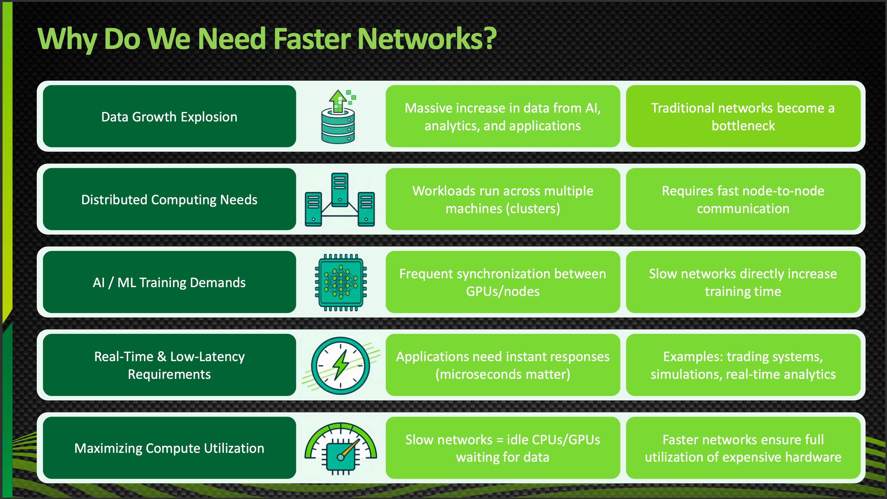

- **Ethernet** giống như **hệ thống đường cao tốc**: dùng chung cho mọi loại "xe" (dữ liệu), linh hoạt nhưng có đèn giao thông, kẹt xe → làm chậm.
- **InfiniBand** giống như **đường ray tàu cao tốc (Shinkansen)**: chỉ dành riêng cho "tàu tốc hành", ít điểm dừng, cực nhanh nhưng giới hạn tuyến đường cụ thể.

> 💡 Ghi nhớ: Ethernet = phổ quát nhưng chậm hơn; InfiniBand = chuyên dụng, cực nhanh, độ trễ cực thấp.


## 3. Lịch sử phát triển InfiniBand

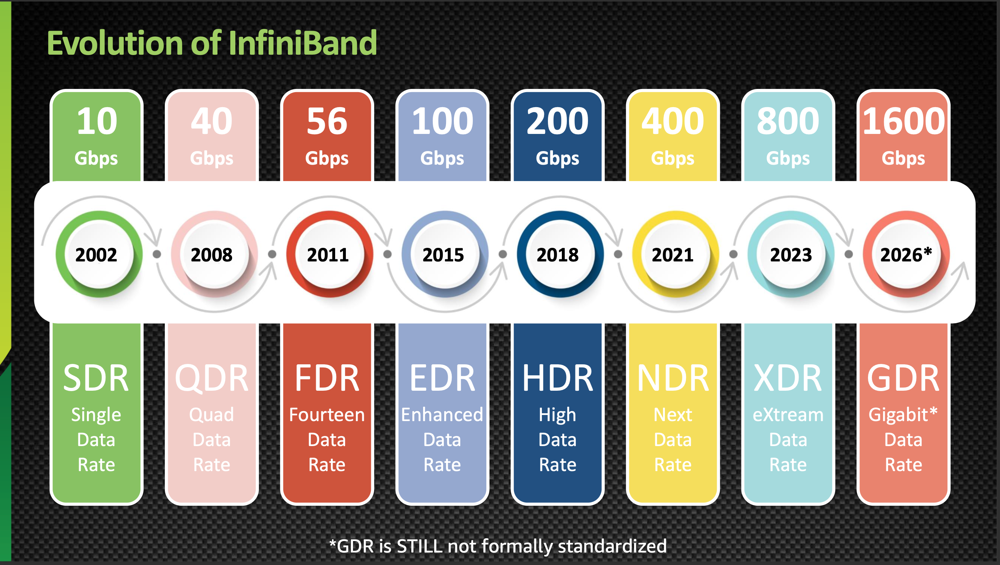

| Năm | Tốc độ | Tên gọi | Viết tắt |
|---|---|---|---|
| 2002 | 10 Gbps | Single Data Rate | SDR |
| 2008 | 40 Gbps | Quad Data Rate | QDR |
| 2011 | 56 Gbps | Fourteen Data Rate | FDR |
| 2015 | 100 Gbps | Enhanced Data Rate | EDR |
| 2018 | 200 Gbps | High Data Rate | HDR |
| 2021 | 400 Gbps | Next Data Rate | NDR |
| 2023 | 800 Gbps | eXtreme Data Rate | XDR |
| 2026* | 1600 Gbps | Gigabit Data Rate | GDR (*chưa chuẩn hoá chính thức) |


## 4. Kết nối InfiniBand tổng quan

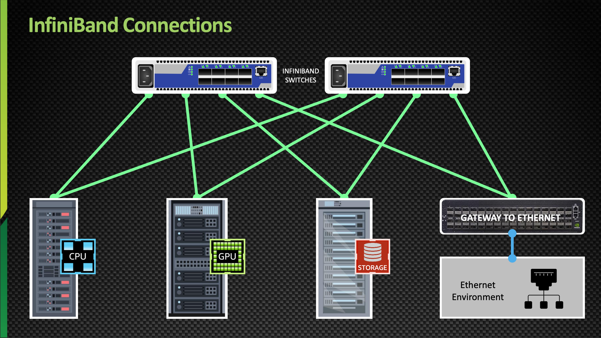

- Các **InfiniBand Switch** kết nối chéo (cross-connect) tới nhiều node: **CPU node, GPU node, Storage node**.
- Có thể có **Gateway to Ethernet** để cầu nối sang môi trường Ethernet truyền thống.


## 5. Kiến trúc phân lớp InfiniBand (Architecture Layers)


InfiniBand có 5 lớp kiến trúc, mỗi lớp được ví như một bước trong quy trình **giao hàng (package delivery)**:

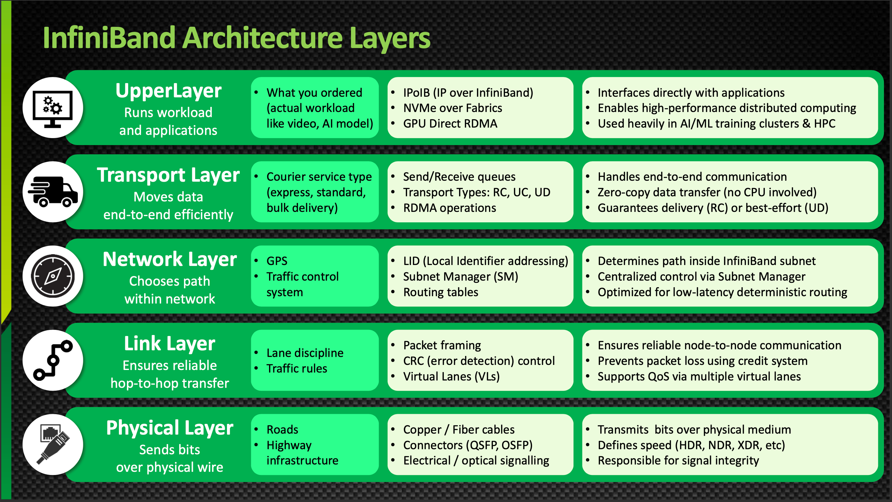


| Lớp | Vai trò | Analogy | Thành phần chính | Chức năng |
|---|---|---|---|---|
| **Upper Layer** | Chạy workload & ứng dụng | Món hàng bạn đặt (video, AI model...) | IPoIB, NVMe over Fabrics, GPU Direct RDMA | Giao tiếp trực tiếp với ứng dụng; dùng nhiều trong AI/ML training & HPC |
| **Transport Layer** | Di chuyển dữ liệu end-to-end hiệu quả | Loại dịch vụ chuyển phát (hoả tốc, tiêu chuẩn, số lượng lớn) | Send/Receive queues, Transport Types (RC, UC, UD), RDMA operations | Truyền zero-copy (không cần CPU); đảm bảo gửi (RC) hoặc best-effort (UD) |
| **Network Layer** | Chọn đường đi trong mạng | GPS, hệ thống điều phối giao thông | LID, Subnet Manager (SM), Routing tables | Định tuyến trong subnet, điều khiển tập trung bởi SM |
| **Link Layer** | Đảm bảo truyền tin cậy hop-to-hop | Luật đi đường, làn đường | Packet framing, CRC, Virtual Lanes (VLs) | Chống mất gói bằng credit system; hỗ trợ QoS qua nhiều virtual lane |
| **Physical Layer** | Truyền bit qua dây vật lý | Con đường, hạ tầng cao tốc | Cáp đồng/quang, connector (QSFP, OSFP), tín hiệu điện/quang | Xác định tốc độ (HDR, NDR, XDR...), đảm bảo tính toàn vẹn tín hiệu |


## 6. Phần cứng & phần mềm theo từng lớp

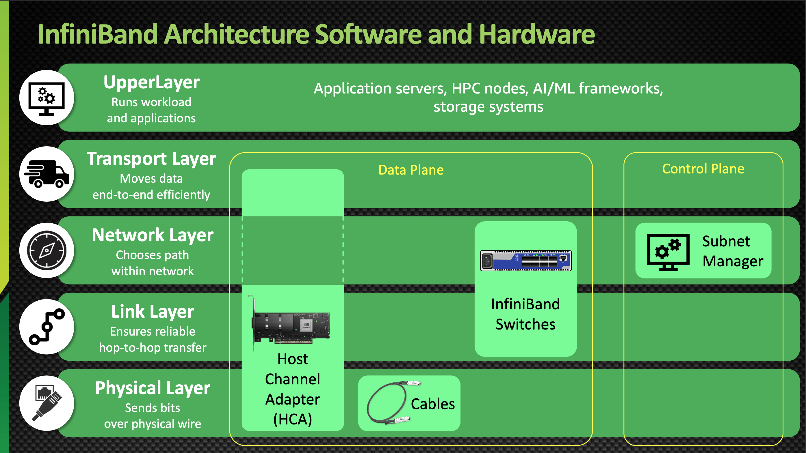

- **Data Plane**: gồm **HCA (Host Channel Adapter)**, **Cables**, **InfiniBand Switches** — xử lý các lớp Transport → Physical.
- **Control Plane**: gồm **Subnet Manager** — quản lý Network Layer (định tuyến, cấu hình fabric).
- **Upper Layer**: chạy trên Application servers, HPC nodes, AI/ML frameworks, storage systems.


## 7. Kết nối vật lý InfiniBand

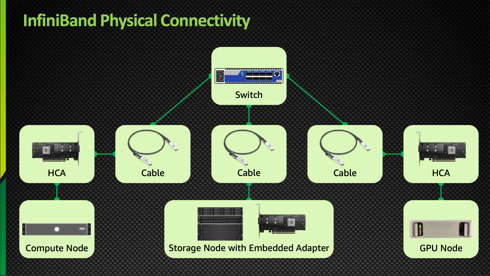

Chuỗi kết nối vật lý cơ bản:

```
Compute Node → HCA → Cable → Switch → Cable → HCA → Storage/GPU Node
```

- **Compute Node**: máy tính (VD: Ubuntu server)
- **HCA**: card giao tiếp InfiniBand
- **Switch**: thiết bị chuyển mạch InfiniBand (VD: Mellanox InfiniBand IS5022 – 8-Port QSFP, 40GB/s)
- **Storage Node with Embedded Adapter**, **GPU Node**: các node đầu cuối


## 8. Host Channel Adapter (HCA) & ConnectX

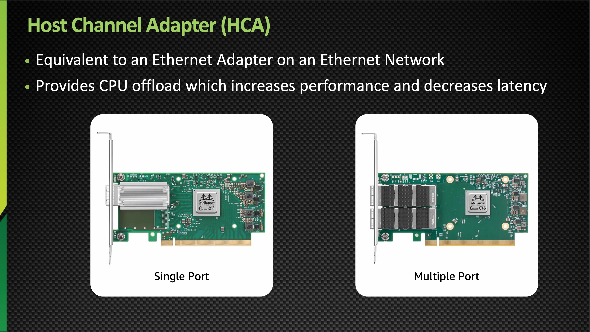

- HCA tương đương **Ethernet Adapter** trên mạng Ethernet.
- Cung cấp **CPU offload** → tăng hiệu năng, giảm độ trễ.
- Có 2 loại: **Single Port** và **Multiple Port**.


**ConnectX** — dòng HCA do NVIDIA phát triển (nguyên gốc từ Mellanox Technologies):

- Là HCA hợp nhất (unified), hỗ trợ **cả InfiniBand & Ethernet**.
- Đời đầu (ConnectX-1): kết nối mạng cơ bản.
- Đời hiện đại (ConnectX-8): accelerator lập trình được, nhiều tính năng offload.
- Là nền tảng cho các DPU như **NVIDIA BlueField**.


## 9. Cáp kết nối (Cables)

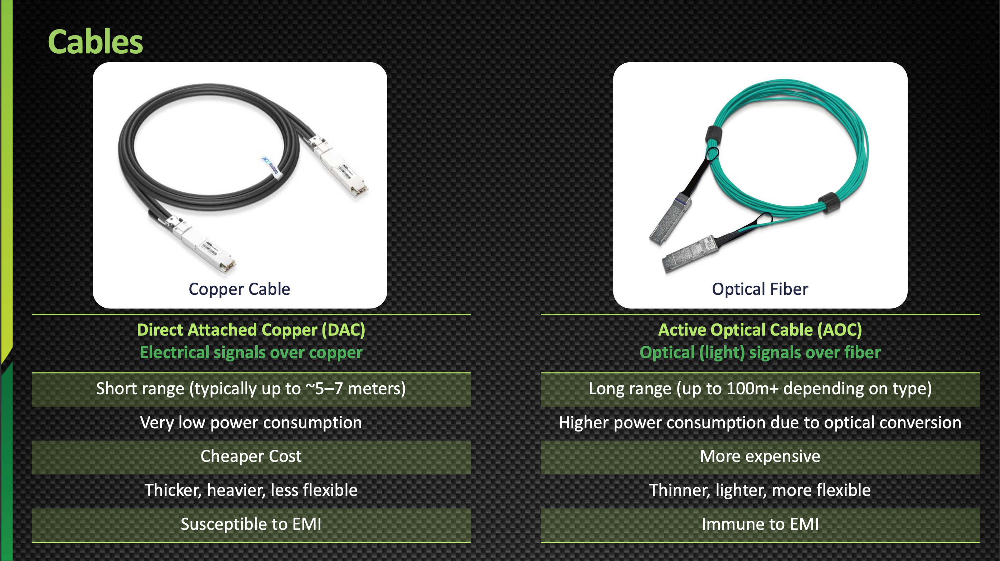

| Đặc điểm | DAC – Direct Attached Copper | AOC – Active Optical Cable |
|---|---|---|
| Loại tín hiệu | Điện, qua dây đồng | Quang (ánh sáng), qua sợi cáp quang |
| Khoảng cách | Ngắn (~5–7 mét) | Xa (100m+ tuỳ loại) |
| Tiêu thụ điện | Rất thấp | Cao hơn (do chuyển đổi quang) |
| Chi phí | Rẻ | Đắt hơn |
| Kích thước | Dày, nặng, kém mềm dẻo | Mỏng, nhẹ, linh hoạt hơn |
| Nhiễu điện từ (EMI) | Dễ bị ảnh hưởng | Miễn nhiễm |


## 10. Thực hành: Kết nối 2 node InfiniBand


| Bước | Hành động | Thực tế diễn ra | Cách kiểm tra |
|---|---|---|---|
| 1 | Hardware Setup | Cài ConnectX HCA, kết nối qua DAC/switch | Đèn LED liên kết sáng (Link LEDs ON) |
| 2 | Driver Installation | Cài OFED / RDMA stack | `ibv_devinfo` hiển thị thiết bị |
| 3 | Subnet Manager (SM) | Chạy `opensm` trên 1 node | Fabric được cấu hình |
| 4 | Fabric Discovery | Các node tự phát hiện nhau | `ibhosts`, `ibnodes` |


## 11. InfiniBand Modules (Kernel Stack)


Từ trên xuống dưới:

1. **Applications**: MPI (Message Passing Interface), NCCL (NVIDIA Collective Communications Library), ibverbs tools...
2. **ib_uverbs**: giao diện user-space cho RDMA (verbs), cho phép app như `ibv_devinfo`, MPI, NCCL hoạt động.
3. **ib_core**: hệ thống con RDMA lõi trong Linux kernel — cung cấp verbs API, device abstraction, queue pair handling, memory registration.
4. **mlx4_ib**: driver giao thức InfiniBand cho thiết bị mlx4 — kết nối hardware (mlx4_core) với RDMA stack (ib_core).
5. **mlx4_core**: driver phần cứng nền tảng cho Mellanox ConnectX-3 — xử lý PCI device, hàng đợi, ngắt (interrupt), thao tác NIC mức thấp.


## 12. Subnet Manager (SM)


**Subnet Manager** là "bộ não" của fabric InfiniBand — khám phá, cấu hình và duy trì toàn bộ mạng.

Chức năng chính:

- **Assigns LIDs** → gán Local Identifier duy nhất cho mỗi port
- **Discovers topology** → tìm tất cả node, switch, liên kết
- **Programs routing tables** → cấu hình switch cho đường đi tối ưu
- **Ensures path consistency** → tránh loop và deadlock
- **Manages partitions (P_Key)** → kiểm soát cách ly & bảo mật
- **Handles link state changes** → tái cấu hình fabric khi có lỗi
- **Optimizes performance** → cân bằng tải trên các đường khả dụng

> Có thể có 1 **Master SM** đang hoạt động, và các **Standby SM** khác để dự phòng (failover).

### SM có thể chạy ở đâu?

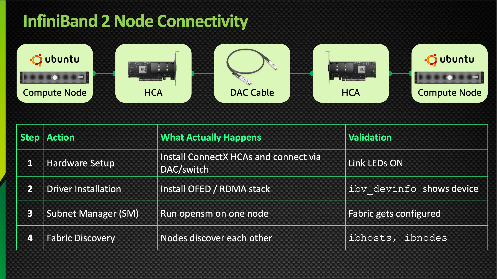

| Vị trí chạy SM | Đặc điểm |
|---|---|
| **Managed Switch** | Phổ biến nhất trong fabric sản xuất; chạy trong switch được quản lý (VD: NVIDIA/Mellanox); độ tin cậy cao, luôn hoạt động cùng fabric |
| **Any Node** | Chạy trên server có HCA (VD: OpenSM); phù hợp cho lab, cluster nhỏ, hoặc tiết kiệm chi phí |
| **Dedicated Mgmt. Node** ⭐ | Server riêng chỉ dùng để quản lý fabric; được ưu tiên trong cluster HPC/AI quy mô lớn |


## 13. GUID & LID

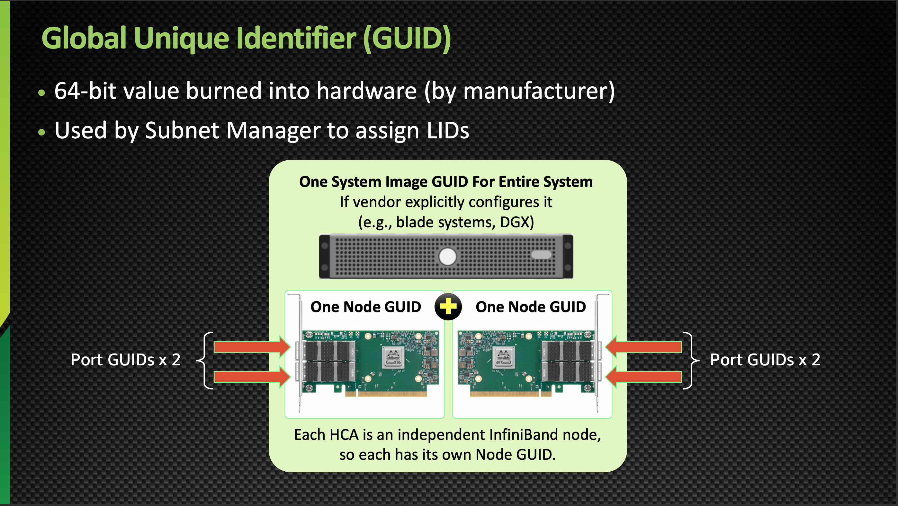

**GUID (Global Unique Identifier)**:

- Giá trị 64-bit được ghi cố định vào phần cứng (bởi nhà sản xuất).
- Được Subnet Manager dùng để gán LID.
- Mỗi HCA là một node InfiniBand độc lập → mỗi HCA có **Node GUID** riêng.
- Một hệ thống (VD: blade system, DGX) có thể có **1 System Image GUID** chung nếu vendor cấu hình như vậy.
- Mỗi port có **Port GUID** riêng.

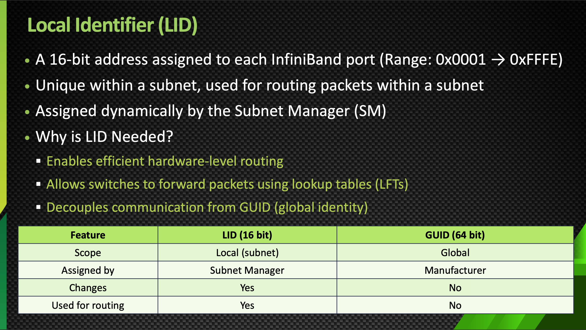

**LID (Local Identifier)**:

- Địa chỉ 16-bit gán cho mỗi port InfiniBand (phạm vi: `0x0001` → `0xFFFE`).
- Duy nhất trong 1 subnet, dùng để định tuyến gói tin trong subnet.
- Được **Subnet Manager gán động**.

| Đặc điểm | LID (16 bit) | GUID (64 bit) |
|---|---|---|
| Phạm vi | Cục bộ (subnet) | Toàn cục |
| Ai gán | Subnet Manager | Nhà sản xuất |
| Có thay đổi không | Có | Không |
| Dùng để định tuyến | Có | Không |


## 14. Các công cụ chẩn đoán InfiniBand

### `ibstat` — xem thông tin adapter

Cài đặt: `sudo apt install infiniband-diags`


Các trường quan trọng trong output `ibstat`:

| Trường | Ý nghĩa |
|---|---|
| `CA 'ibp1s0'` | Channel Adapter – thiết bị InfiniBand tại vị trí PCI (port 1, slot 0) |
| `CA type: MT4099` | Model phần cứng của adapter (chipset Mellanox) |
| `Hardware version` | Phiên bản phần cứng nội bộ |
| `Rate: 40` | Tốc độ liên kết = 40 Gb/giây (QDR InfiniBand) |
| `Base lid` | LID được gán bởi Subnet Manager |
| `LMC` | LID Mask Control – số lượng LID gán cho port (0 = chỉ 1 LID, không multipathing) |
| `SM lid` | LID của Subnet Manager |
| `Capability mask` | Bitmask – chủ yếu dùng cho chẩn đoán mức thấp |

### `ibping` — kiểm tra kết nối giữa các node

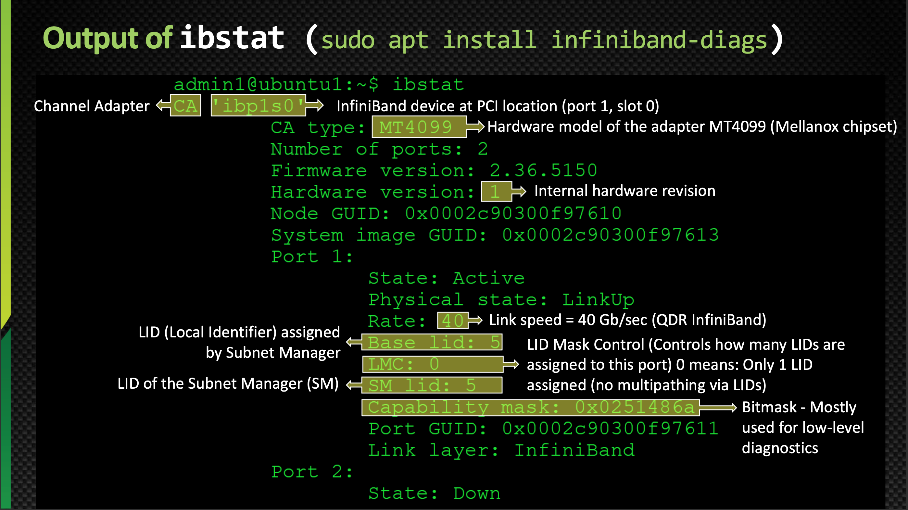

- Hoạt động ở lớp InfiniBand (LID/GUID), **không dựa trên IP**.
- Cách dùng:
  - Node server: `ibping -S`
  - Node client: `ibping -L <LID>`

### `ibnetdiscover` — khám phá topology toàn bộ fabric


Hiển thị: Node (HCA), Switch, Port và các liên kết → coi như "bản đồ topology của mạng IB".

### Các công cụ hữu ích khác

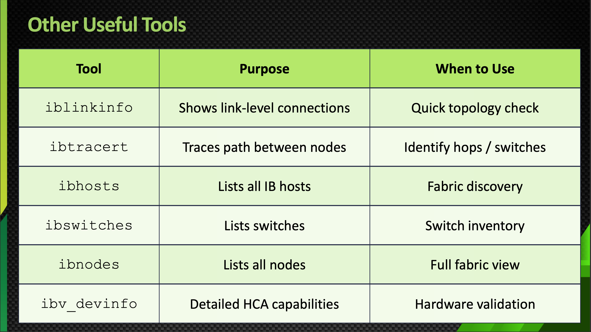

| Công cụ | Mục đích | Khi nào dùng |
|---|---|---|
| `iblinkinfo` | Hiển thị kết nối mức link | Kiểm tra topology nhanh |
| `ibtracert` | Truy vết đường đi giữa các node | Xác định số hop / switch |
| `ibhosts` | Liệt kê tất cả host IB | Khám phá fabric |
| `ibswitches` | Liệt kê switch | Kiểm kê switch |
| `ibnodes` | Liệt kê tất cả node | Xem toàn cảnh fabric |
| `ibv_devinfo` | Thông tin chi tiết khả năng HCA | Xác thực phần cứng |


## 15. So sánh Ethernet vs InfiniBand


| Đặc điểm | Ethernet | InfiniBand |
|---|---|---|
| Analogy | Hệ thống cao tốc: phù hợp mọi loại xe nhưng có kẹt xe, đèn tín hiệu | Đường ray tàu cao tốc: chỉ dành cho tàu tốc hành, ít điểm dừng |
| Lịch sử | Ra đời thập niên 1970 cho mạng văn phòng, trở thành chuẩn toàn cầu | Ra đời năm 2000 cho siêu máy tính, vẫn là công nghệ ngách nhưng thiết yếu cho HPC/AI |
| Mục đích | Mạng đa dụng (LAN, WAN, internet) | Điện toán hiệu năng cao (HPC), cluster AI, trung tâm dữ liệu |
| Tốc độ | 1 Gbps → 400 Gbps* | 10 Gbps → 400 Gbps* |
| Độ trễ | Cao hơn (~10–100 µs) | Cực thấp (~1–2 µs) |
| Ngăn xếp giao thức | TCP/IP (thêm overhead) | RDMA – bỏ qua CPU, overhead rất thấp |
| Chi phí | Rẻ, phần cứng phổ thông | Đắt hơn, phần cứng chuyên dụng |
| Tính linh hoạt | Dùng mọi nơi: nhà, văn phòng, data center, internet | Ngách: chủ yếu HPC, cluster AI training, kết nối storage |
| Hệ sinh thái | Hỗ trợ phổ quát (mọi OS, thiết bị, NIC) | Driver & phần mềm chuyên biệt |
| Độ tin cậy | Tốt cho mạng đa dụng, nhưng nghẽn gây trễ | Lossless/gần như không mất gói, thiết kế hiệu năng tất định |


## 16. So sánh TCP/IP vs InfiniBand

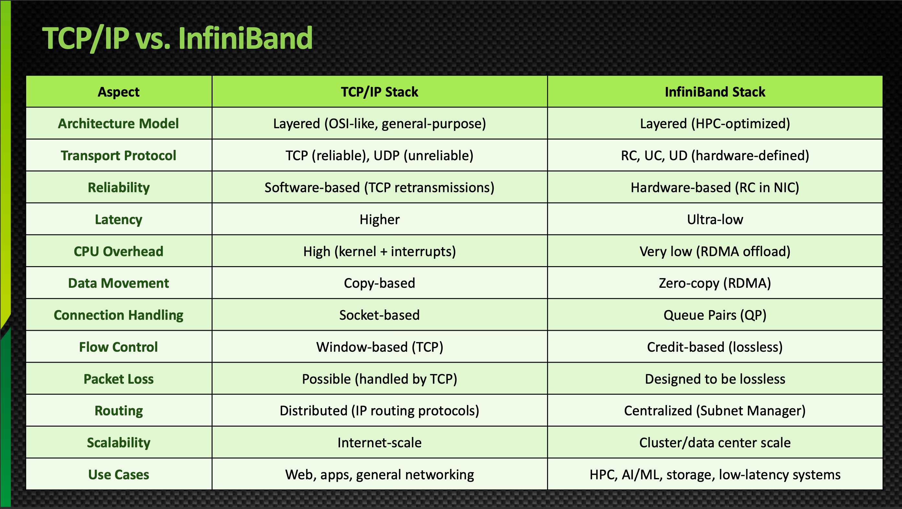

| Khía cạnh | TCP/IP Stack | InfiniBand Stack |
|---|---|---|
| Mô hình kiến trúc | Phân lớp (giống OSI, đa dụng) | Phân lớp (tối ưu cho HPC) |
| Giao thức Transport | TCP (tin cậy), UDP (không tin cậy) | RC, UC, UD (định nghĩa bởi phần cứng) |
| Độ tin cậy | Dựa trên phần mềm (TCP retransmission) | Dựa trên phần cứng (RC trong NIC) |
| Độ trễ | Cao hơn | Cực thấp |
| CPU Overhead | Cao (kernel + interrupt) | Rất thấp (RDMA offload) |
| Di chuyển dữ liệu | Copy-based | Zero-copy (RDMA) |
| Xử lý kết nối | Socket-based | Queue Pairs (QP) |
| Điều khiển luồng | Window-based (TCP) | Credit-based (lossless) |
| Mất gói | Có thể xảy ra (TCP xử lý) | Thiết kế để lossless |
| Định tuyến | Phân tán (giao thức định tuyến IP) | Tập trung (Subnet Manager) |
| Khả năng mở rộng | Quy mô internet | Quy mô cluster/data center |
| Trường hợp dùng | Web, ứng dụng, mạng đa dụng | HPC, AI/ML, storage, hệ thống độ trễ thấp |


## 17. NVIDIA InfiniBand Stack (Hardware & Software)

### 17.1. NVIDIA & sự thống trị trong InfiniBand


| Giai đoạn | Sự kiện |
|---|---|
| **1999–2001** | Khai sinh InfiniBand — thành lập bởi Intel, IBM, Cisco, Sun. Mục tiêu: thay thế nút thắt cổ chai PCI + Ethernet bằng fabric tốc độ cao, độ trễ thấp |
| **2001–2009** | Mellanox Technologies nổi lên là động lực thương mại chính của InfiniBand; InfiniBand trở thành interconnect mặc định cho siêu máy tính |
| **2019–2020** | NVIDIA mua lại Mellanox; định vị InfiniBand là **"không chỉ là networking – mà là AI fabric"**; InfiniBand trở thành xương sống hạ tầng AI sau khi tích hợp dọc với GPU |

### 17.2. NVIDIA InfiniBand Hardware Stack

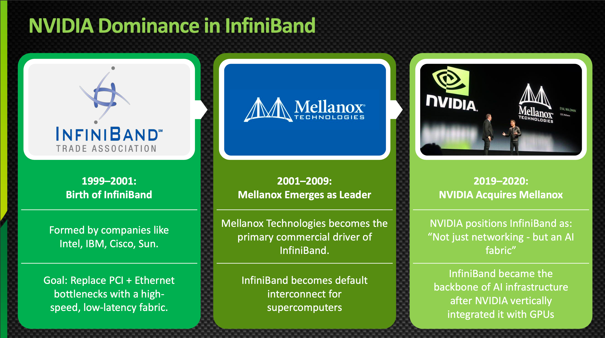

| Dòng sản phẩm | Loại | Mô tả | Điểm đặc biệt | Model mới nhất |
|---|---|---|---|---|
| **LinkX** (Cables & Transceivers) | Cáp | Kết nối đồng/quang | Được kiểm định trên hệ thống NVIDIA switch + GPU | LinkX XDR 800G |
| **ConnectX Cards** (ConnectX-1 → 9) | HCA/NIC | Hỗ trợ Virtual Protocol Interconnect (VPI) – cả IB & Ethernet (RoCE) trên 1 card | Model mới hỗ trợ offload crypto & firewall phần cứng; dùng trong DGX Systems | ConnectX-8 (C8180), ConnectX-9 (đã công bố) |
| **BlueField DPU** (BlueField-1 → 4) | DPU | Data Processing Unit tích hợp ConnectX NIC + CPU Arm | Xây dựng riêng cho "AI factories"; lập trình qua DOCA SDK | BlueField-3 (B3240), BlueField-4 (đã công bố) |
| **InfiniBand Switches (Legacy)** SX / IS | Switch | Nền tảng switch InfiniBand thế hệ đầu | Cho phép fabric HPC quy mô lớn; SX hỗ trợ VPI | SX6036, SX6790, IS5022, IS5030 |
| **Quantum Switches** | Switch | Cấu hình cố định & module | Offload phần cứng cho AI/HPC; tự tính toán, thích ứng, tự phục hồi | QM9700, QM9790 |

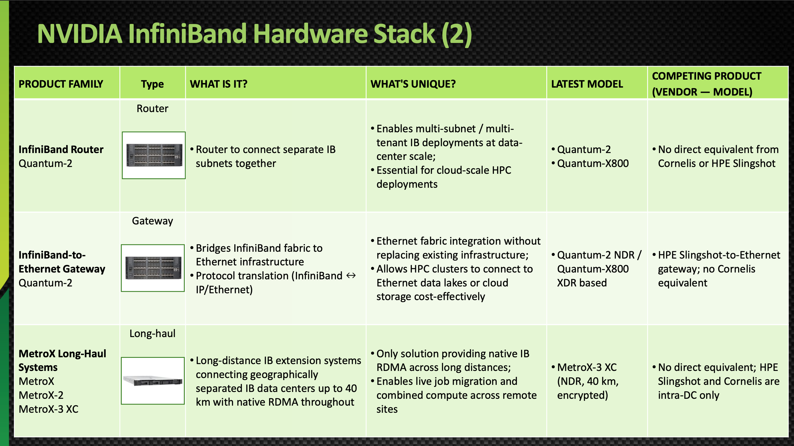

| Dòng sản phẩm | Loại | Mô tả | Điểm đặc biệt | Model mới nhất |
|---|---|---|---|---|
| **InfiniBand Router** (Quantum-2) | Router | Kết nối nhiều subnet IB riêng biệt | Cho phép triển khai IB đa subnet/đa tenant ở quy mô data center | Quantum-2, Quantum-X800 |
| **InfiniBand-to-Ethernet Gateway** (Quantum-2) | Gateway | Cầu nối fabric InfiniBand với hạ tầng Ethernet | Tích hợp Ethernet mà không cần thay thế hạ tầng hiện có | Quantum-2 NDR / Quantum-X800 XDR |
| **MetroX Long-Haul Systems** | Long-haul | Hệ thống mở rộng IB khoảng cách xa, kết nối data center cách nhau tới 40km, RDMA gốc xuyên suốt | Giải pháp duy nhất cung cấp RDMA gốc trên khoảng cách xa | MetroX-3 XC (NDR, 40km, mã hoá) |

### 17.3. NVIDIA InfiniBand Software Stack

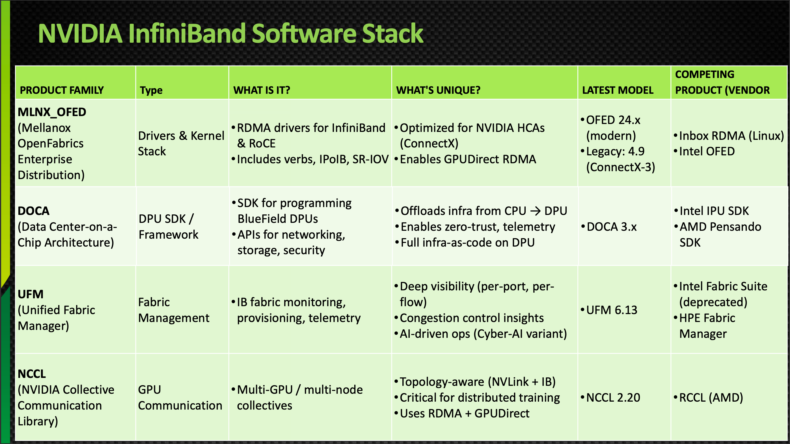

| Thành phần | Loại | Mô tả | Điểm đặc biệt | Phiên bản mới nhất |
|---|---|---|---|---|
| **MLNX_OFED** (Mellanox OpenFabrics Enterprise Distribution) | Drivers & Kernel Stack | Driver RDMA cho InfiniBand & RoCE; gồm verbs, IPoIB, SR-IOV | Tối ưu cho HCA của NVIDIA (ConnectX); hỗ trợ GPUDirect RDMA | OFED 24.x (hiện đại), Legacy 4.9 (ConnectX-3) |
| **DOCA** (Data Center-on-a-Chip Architecture) | DPU SDK/Framework | SDK lập trình BlueField DPU; API cho networking, storage, security | Offload hạ tầng từ CPU → DPU; "CUDA cho hạ tầng" | DOCA 3.x |
| **UFM** (Unified Fabric Manager) | Quản lý Fabric | Giám sát, cấp phát, đo lường fabric IB | Khả năng quan sát sâu (per-port, per-flow); AI-driven ops (biến thể Cyber-AI) | UFM 6.13 |
| **NCCL** (NVIDIA Collective Communications Library) | Giao tiếp GPU | Giao tiếp collective đa GPU/đa node | Nhận biết topology (NVLink + IB); dùng RDMA + GPUDirect | NCCL 2.20 |


## 18. Cài đặt OFED Drivers

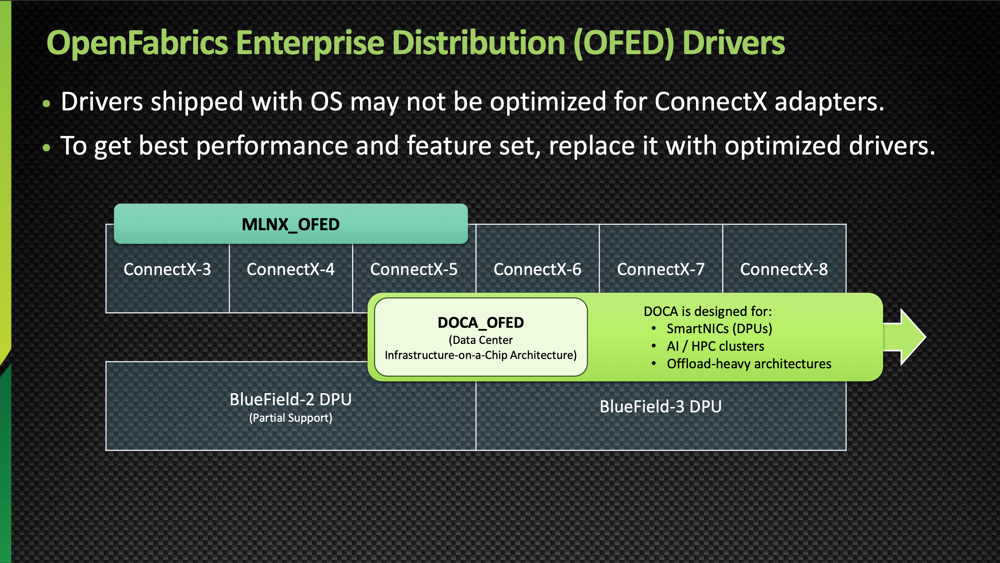

- Driver có sẵn trong OS **có thể không được tối ưu** cho adapter ConnectX.
- Để đạt hiệu năng & tính năng tốt nhất → cần thay bằng driver tối ưu.
- **MLNX_OFED**: hỗ trợ ConnectX-3 → ConnectX-8, BlueField-2 (hỗ trợ một phần).
- **DOCA_OFED**: thiết kế cho SmartNIC (DPU), cluster AI/HPC, kiến trúc offload-heavy; hỗ trợ BlueField-3.

### Kiểm tra loại driver đang dùng


```bash
lsmod | grep mlx
modinfo mlx5_core | grep filename
```

- Nếu `filename` chứa `kernel/drivers/net/ethernet/mellanox/mlx5/...` → đang dùng driver **mặc định của kernel/OS**.
- Nếu `filename` chứa `updates/dkms/mlx5_core.ko` → đang dùng driver **MLNX_OFED (đã cài thủ công)**.

Kiểm tra xác nhận:

```bash
ofed_info
```

### Tải và cài đặt

- Trang tải: https://network.nvidia.com/products/infiniband-drivers/linux/mlnx_ofed/

```bash
sudo ./mlnxofedinstall --add-kernel-support --fw-update
```

> Lệnh này sẽ tự động kiểm tra và cập nhật firmware cho thiết bị Mellanox nếu cần (VD: ConnectX-3 từ FW 2.36.5150 → 2.42.5000).


## 19. Tài liệu tham khảo thêm


- 📚 Các khoá học Udemy khác: https://www.udemy.com/user/ashish-prajapati-138/ *(liên hệ để lấy voucher giảm giá)*
- 🎓 Bootcamp trực tiếp: https://maven.com/nvidia-cert
- 🌐 Website: https://analogiescloud.com/
- 🔗 LinkedIn: https://www.linkedin.com/in/ash-tech/


## ✅ Ghi chú nhanh cần nhớ (Quick Recap)

- **InfiniBand = mạng chuyên dụng, độ trễ cực thấp, dùng RDMA**, phổ biến trong HPC/AI cluster.
- Kiến trúc 5 lớp: **Upper → Transport → Network → Link → Physical**.
- **HCA** = "card mạng" InfiniBand; **ConnectX** là dòng HCA của NVIDIA (hỗ trợ cả IB & Ethernet).
- **Subnet Manager (SM)** là "bộ não" quản lý toàn bộ fabric — bắt buộc phải có trong mạng IB.
- **GUID** (64-bit, cố định, gán bởi nhà sản xuất) khác **LID** (16-bit, gán động bởi SM, dùng để định tuyến).
- Công cụ chẩn đoán quan trọng: `ibstat`, `ibping`, `ibnetdiscover`, `ibhosts`, `ibswitches`, `ibnodes`, `iblinkinfo`, `ibtracert`, `ibv_devinfo`.
- NVIDIA hiện sở hữu toàn bộ stack InfiniBand (phần cứng: ConnectX, BlueField, Quantum Switch, LinkX; phần mềm: MLNX_OFED, DOCA, UFM, NCCL) sau khi mua lại Mellanox (2019–2020).