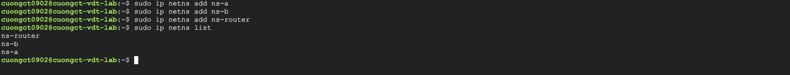
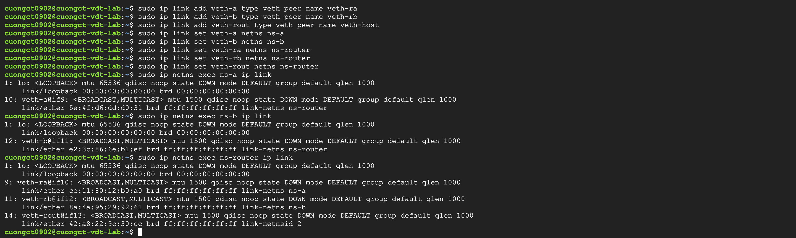
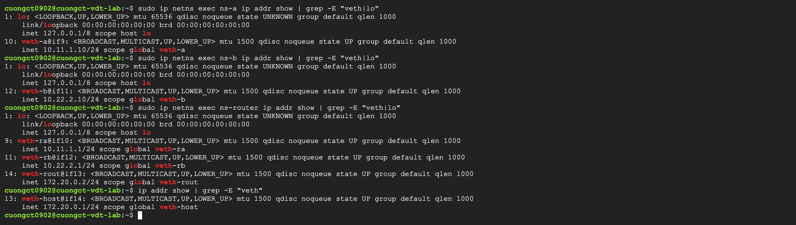
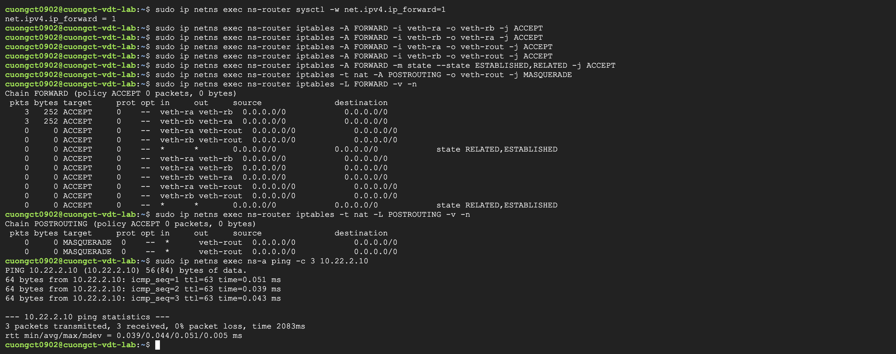
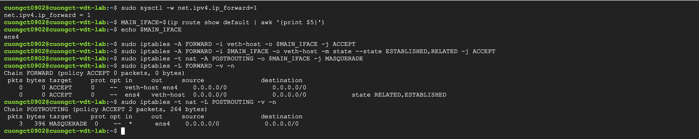
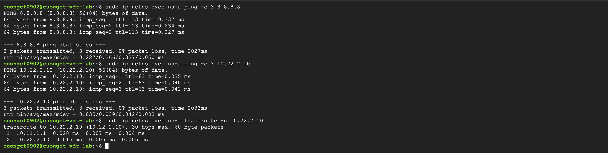

# Lab02 - Linux Network Namespace - VDT Cloud 2026

> Sinh viên: Đặng Tiến Cường - Đại Học Bách Khoa Hà Nội

## Mục tiêu bài tập

- Tạo 3 network namespace riêng biệt: `ns-a`, `ns-b`, `ns-router`.
- Kết nối 3 namespace qua `veth` pairs, `ns-a` và `ns-b` giao tiếp được với nhau qua `ns-router`.
- Namespace `ns-router` hoạt động như một router: IP Routing và NAT. Cần cấu hình:
  - **Forwarding**: IP forward + `iptables` FORWARD rules.
  - **NAT**: `MASQUERADE` cho traffic ra ngoài.

## Môi trường

### 1. Thông tin VM Host

- **Hệ điều hành:** Ubuntu 24.04 LTS Minimal (Noble)
- **Cấu hình phần cứng:** `n2-standard-4` (4 vCPUs, 16 GB RAM)
- **Công cụ sử dụng:** `iproute2`, `iptables`

### 2. Sơ đồ mô phỏng kết nối (Topology)

Để `ns-a` và `ns-b` có thể kết nối với nhau qua `ns-router` và bản thân `ns-router` có thể đưa traffic ra Internet thông qua Host VM, chúng ta sẽ xây dựng mô hình mạng như sau:

```
       [ INTERNET ]
            |
        (eth0/ens4)
         [ Host ] <--- (IP Forward + NAT Masquerade)
        (veth-host) 172.20.0.1/24
            |
            | (veth pair)
            |
       (veth-rout) 172.20.0.2/24
      [ ns-router ] <--- (IP Forward: Enabled, NAT: Masquerade)
     (veth-ra)        (veth-rb)
    10.11.1.1/24    10.22.2.1/24
        |                |
        | (veth pair)    | (veth pair)
        |                |
     (veth-a)         (veth-b)
   10.11.1.10/24    10.22.2.10/24
     [ ns-a ]          [ ns-b ]
```

### 3. Bảng phân hoạch địa chỉ IP (IP Allocation)

| Namespace | Interface | Địa chỉ IP | Gateway | Chức năng |
|-----------|-----------|------------|---------|-----------|
| **Host** | `veth-host` | `172.20.0.1/24` | N/A | Gateway kết nối `ns-router` ra Internet |
| **ns-router** | `veth-rout` | `172.20.0.2/24` | `172.20.0.1` | Nhận và định tuyến gói tin, thực hiện NAT |
| **ns-router** | `veth-ra` | `10.11.1.1/24` | N/A | Nhận và định tuyến gói tin, thực hiện NAT |
| **ns-router** | `veth-rb` | `10.22.2.1/24` | N/A | Nhận và định tuyến gói tin, thực hiện NAT |
| **ns-a** | `veth-a` | `10.11.1.10/24` | `10.11.1.1` | Môi trường client mạng A |
| **ns-b** | `veth-b` | `10.22.2.10/24` | `10.22.2.1` | Môi trường client mạng B |

## Cấu hình

### Bước 1: Chuẩn bị công cụ và khởi tạo các Namespace

Vì là bản Ubuntu Minimal nên ta cần cài thêm gói công cụ định tuyến `iptables`.

```bash
# Cập nhật hệ thống và cài đặt iptables
sudo apt-get update && sudo apt-get install -y iptables traceroute iputils-ping 

# Tạo 3 network namespace riêng biệt
sudo ip netns add ns-a
sudo ip netns add ns-b
sudo ip netns add ns-router

# Verify các namespace sau khi tạo
sudo ip netns list
```




### Bước 2: Tạo và liên kết các cặp veth

Ta tạo 3 cặp dây ảo (`veth pairs`) để đấu nối các Node theo sơ đồ mạng.

```bash
# -- Tạo các cặp veth kết nối giữa các Namespace --
sudo ip link add veth-a type veth peer name veth-ra
sudo ip link add veth-b type veth peer name veth-rb
sudo ip link add veth-rout type veth peer name veth-host

# -- Di chuyển các interface vào đúng Namespace chỉ định --
sudo ip link set veth-a netns ns-a
sudo ip link set veth-ra netns ns-router

sudo ip link set veth-b netns ns-b
sudo ip link set veth-rb netns ns-router

# -- veth-host giữ nguyên ở Host Namespace --
sudo ip link set veth-rout netns ns-router


# -- Verify việc move các veth interface vào namespace tương ứng --
sudo ip netns exec ns-a ip link
sudo ip netns exec ns-b ip link
sudo ip netns exec ns-router ip link
```



### Bước 3: Cấu hình IP và kích hoạt Interface trên các Namespace

```bash
# --- Cấu hình Namespace ns-a ---
sudo ip netns exec ns-a ip link set lo up
sudo ip netns exec ns-a ip link set veth-a up
sudo ip netns exec ns-a ip addr add 10.11.1.10/24 dev veth-a
sudo ip netns exec ns-a ip route add default via 10.11.1.1

# --- Cấu hình Namespace ns-b ---
sudo ip netns exec ns-b ip link set lo up
sudo ip netns exec ns-b ip link set veth-b up
sudo ip netns exec ns-b ip addr add 10.22.2.10/24 dev veth-b
sudo ip netns exec ns-b ip route add default via 10.22.2.1

# --- Cấu hình Namespace ns-router ---
sudo ip netns exec ns-router ip link set lo up
sudo ip netns exec ns-router ip link set veth-ra up
sudo ip netns exec ns-router ip link set veth-rb up
sudo ip netns exec ns-router ip link set veth-rout up

sudo ip netns exec ns-router ip addr add 10.11.1.1/24 dev veth-ra
sudo ip netns exec ns-router ip addr add 10.22.2.1/24 dev veth-rb
sudo ip netns exec ns-router ip addr add 172.20.0.2/24 dev veth-rout
sudo ip netns exec ns-router ip route add default via 172.20.0.1

# --- Cấu hình phía Host ---
sudo ip link set veth-host up
sudo ip addr add 172.20.0.1/24 dev veth-host

# -- Verify kết quả cấu hình --
sudo ip netns exec ns-a ip addr show | grep -E "veth|lo"
sudo ip netns exec ns-b ip addr show | grep -E "veth|lo"
sudo ip netns exec ns-router ip addr show | grep -E "veth|lo"
```


### Bước 4: Cấu hình Routing và NAT (MASQUERADE)

#### 4.1 Cấu hình định tuyến bên trong `ns-router`

```bash
# -- Bật IP Forwarding bên trong ns-router --
sudo ip netns exec ns-router sysctl -w net.ipv4.ip_forward=1

# -- Cấu hình iptables FORWARD rules cho phép traffic đi qua router --
sudo ip netns exec ns-router iptables -A FORWARD -i veth-ra -o veth-rb -j ACCEPT
sudo ip netns exec ns-router iptables -A FORWARD -i veth-rb -o veth-ra -j ACCEPT
sudo ip netns exec ns-router iptables -A FORWARD -i veth-ra -o veth-rout -j ACCEPT
sudo ip netns exec ns-router iptables -A FORWARD -i veth-rb -o veth-rout -j ACCEPT
sudo ip netns exec ns-router iptables -A FORWARD -m state --state ESTABLISHED,RELATED -j ACCEPT

# -- Cấu hình NAT MASQUERADE cho traffic từ ns-a và ns-b đi ra ngoài qua veth-rout --
sudo ip netns exec ns-router iptables -t nat -A POSTROUTING -o veth-rout -j MASQUERADE

# -- Verify kết quả cấu hình --
sudo ip netns exec ns-router iptables -L FORWARD -v -n
sudo ip netns exec ns-router iptables -t nat -L POSTROUTING -v -n
sudo ip netns exec ns-a ping -c 3 10.22.2.10
```


#### 4.2 Cấu hình định tuyến trên Host (Để các Namespace truy cập được Internet)

```bash
# -- Bật IP Forwarding trên Host máy ảo --
sudo sysctl -w net.ipv4.ip_forward=1

# -- Tự động lấy tên interface mạng chính của VM --
MAIN_IFACE=$(ip route show default | awk '{print $5}')

# -- Cho phép Forward và ẩn địa chỉ (MASQUERADE) dải mạng 172.20.0.0/24 ra Internet --
sudo iptables -A FORWARD -i veth-host -o $MAIN_IFACE -j ACCEPT
sudo iptables -A FORWARD -i $MAIN_IFACE -o veth-host -m state --state ESTABLISHED,RELATED -j ACCEPT
sudo iptables -t nat -A POSTROUTING -o $MAIN_IFACE -j MASQUERADE

# -- Verify kết quả cấu hình --
sudo iptables -L FORWARD -v -n
sudo iptables -t nat -L POSTROUTING -v -n
```


### Bước 5: Kiểm tra và xác thực kết nối (Verification)

```bash
# 1. Kiểm tra ns-a kết nối tới ns-b (Ping chéo qua router)
sudo ip netns exec ns-a ping -c 3 10.22.2.10

# 2. Kiểm tra trace đường đi từ ns-a sang ns-b xem có qua IP của ns-router không
sudo ip netns exec ns-a traceroute -n 10.22.2.10

# 3. Kiểm tra ns-a ra được Internet công cộng (DNS của Google)
sudo ip netns exec ns-a ping -c 3 8.8.8.8
```


## Kết luận

- Bài lab đã triển khai thành công mô hình cô lập tài nguyên mạng bằng công nghệ Linux Network Namespace.
- Việc kết nối thành công giữa `ns-a` và `ns-b` chứng minh cơ chế IP Routing của `ns-router` hoạt động chính xác.
- Nhờ vào việc áp dụng chính sách `FORWARD` rules kiểm soát chặt chẽ cùng kỹ thuật `NAT MASQUERADE`, các máy trạm nằm trong vùng mạng nội bộ cô lập (`ns-a`, `ns-b`) vẫn có khả năng giao tiếp ra môi trường mạng ngoài (Internet) một cách an toàn mà không bị lộ dải IP nội bộ.