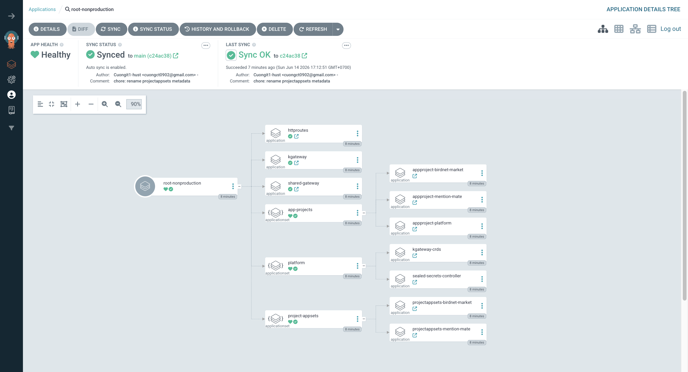
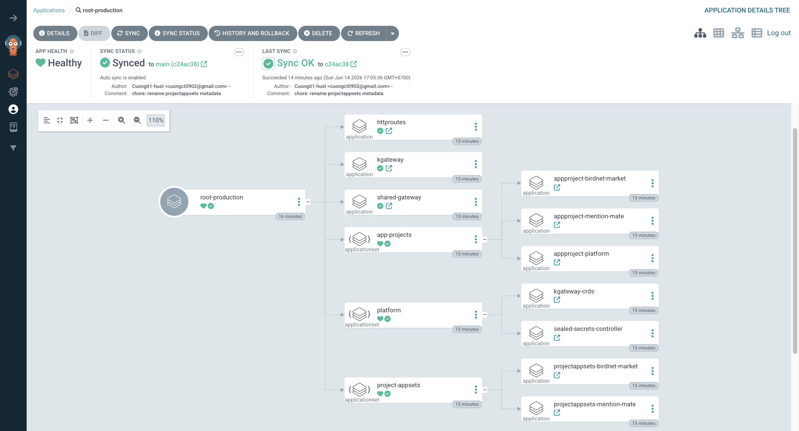
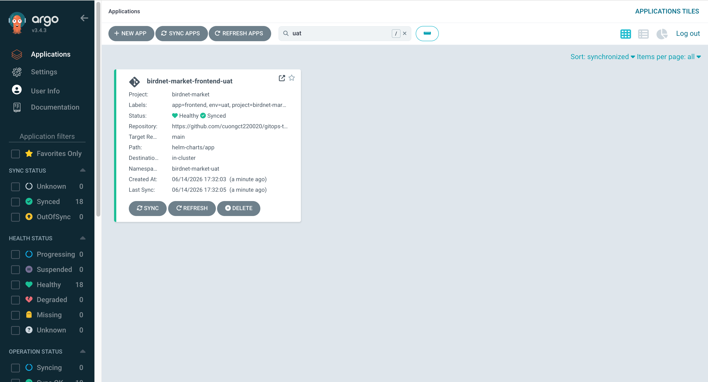
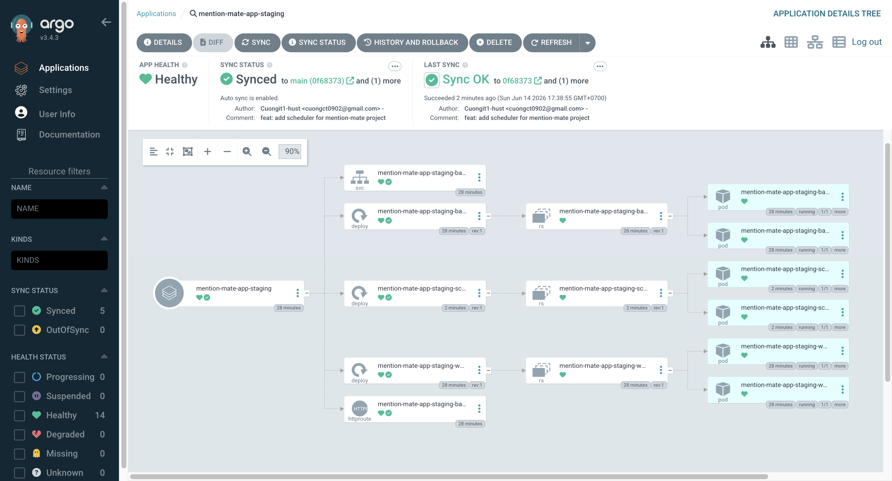
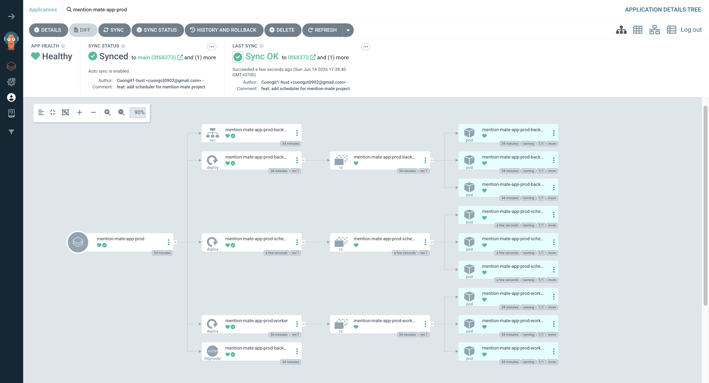
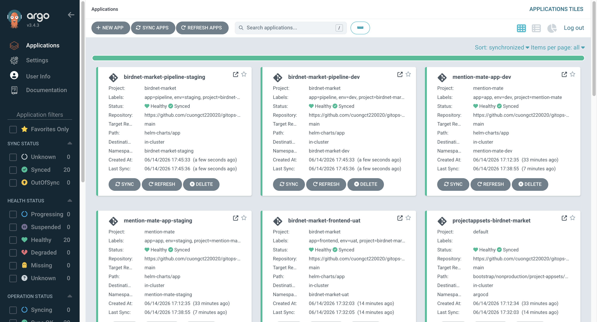
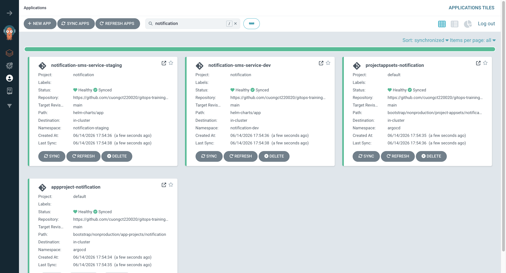
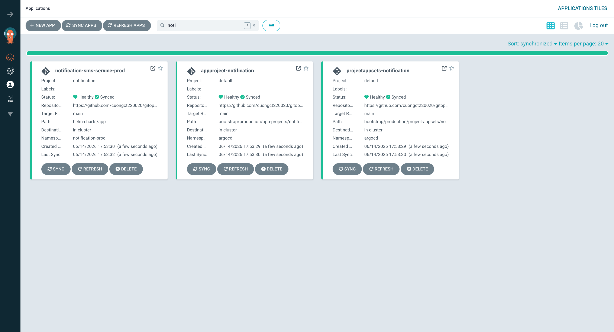

# Gitops Traing Labs

> Sinh viên: Đặng Tiến Cường - Đại Học Bách Khoa Hà Nội

Báo cáo bài tập về nhà [Gitops Traing Labs](https://github.com/cuongct220020/gitops-training.git)

## Setup Guide của mentor

### 1. Cài đặt RKE2

```bash
curl -sfL https://get.rke2.io | INSTALL_RKE2_TYPE="server" INSTALL_RKE2_CHANNEL="stable" sh -
```

### 2. Cấu hình RKE2

```bash
mkdir -p /etc/rancher/rke2/
vim /etc/rancher/rke2/config.yaml
```

```yaml
cni:
  - cilium
disable-cloud-controller: true
disable:
  - rke2-ingress-nginx
  - rke2-metrics-server
```

### 3. Khởi động RKE2

```bash
systemctl enable rke2-server.service --now
```

### 4. Fix Cilium Operator (1 node)

Vì chỉ có 1 node, giảm replicas của Cilium Operator xuống còn 1:

```bash
kubectl -n kube-system patch deployment cilium-operator \
  --type='json' \
  -p='[{"op": "replace", "path": "/spec/replicas", "value":1}]'
```

### 5. Cài đặt Gateway API và ArgoCD

```bash
# Gateway API
kubectl apply -f https://github.com/kubernetes-sigs/gateway-api/releases/download/v1.5.1/standard-install.yaml

# ArgoCD
kubectl create namespace argocd
kubectl apply -n argocd --server-side --force-conflicts -f https://raw.githubusercontent.com/argoproj/argo-cd/stable/manifests/install.yaml
```

### 6. Cấu hình ArgoCD insecure mode

```bash
kubectl -n argocd patch configmap argocd-cmd-params-cm \
  --type merge -p '{"data":{"server.insecure":"true"}}'
kubectl -n argocd rollout restart deploy argocd-server
```

### 7. Lấy mật khẩu admin ArgoCD

```bash
kubectl -n argocd get secret argocd-initial-admin-secret \
  -o jsonpath='{.data.password}' | base64 -d; echo
```

## Kết quả bài tập thực hành

### Bài 1 — Bootstrap cơ bản

Fork repo, sửa `repoURL` trong các file root cho khớp với repo của bạn, sau đó bootstrap cả 2 tier:

#### Root App Non-Production


#### Root App Production


Kiểm tra ArgoCD UI — toàn bộ app phải ở trạng thái `Synced` + `Healthy`.

### Bài 2 — Thêm env `uat` cho `frontend`




### Bài 3 — Thêm deployment `scheduler` vào `mention-mate/app`

#### Dev/Staging Web UI


#### Production Web UI



### Bài 4 — Thêm app mới `pipeline` cho `birdnet-market`




### Bài 5 — (Nâng cao) Thêm project mới `notification`

#### Dev/Staging Web UI


#### Production Web UI



