# Lab03 - Linux Storage Fundamentals & Ceph Cluster - VDT Cloud 2026

> Sinh viên: Đặng Tiến Cường - Đại Học Bách Khoa Hà Nội

## Phần 1 — Basic: Làm quen với Storage trên Virtual Machine

### Mục tiêu

- Tạo một VM Linux trên GCP.
- Tạo một Partition mới dung lượng 1 GB, gắn vào VM và mount để đọc/ghi dữ liệu.
- Mở rộng dung lượng partition đó lên 2 GB và tiếp tục đọc/ghi dữ liệu.

### Môi trường

- **Hệ điều hành:** Ubuntu 24.04 LTS Minimal (Noble)
- **Nền tảng:** Google Cloud Platform (GCP)
- **Công cụ sử dụng:** `fdisk`, `mkfs`, `mount`, `resize2fs`, `df`

### Bước 1. Tạo VM và gắn Raw Disk

```bash
gcloud compute instances create cuongct-storage-lab \
    --project=project-e8563bf4-58ff-402f-ac1 \
    --zone=asia-southeast1-b \
    --machine-type=n2-standard-4 \
    --network-interface=network-tier=PREMIUM,stack-type=IPV4_ONLY,subnet=default \
    --metadata=enable-osconfig=TRUE \
    --maintenance-policy=MIGRATE \
    --provisioning-model=STANDARD \
    --service-account=1058769778175-compute@developer.gserviceaccount.com \
    --scopes=https://www.googleapis.com/auth/devstorage.read_only,https://www.googleapis.com/auth/logging.write,https://www.googleapis.com/auth/monitoring.write,https://www.googleapis.com/auth/service.management.readonly,https://www.googleapis.com/auth/servicecontrol,https://www.googleapis.com/auth/trace.append \
    --create-disk=auto-delete=yes,boot=yes,device-name=cuongct-vm-lab,image=projects/ubuntu-os-cloud/global/images/ubuntu-minimal-2404-noble-amd64-v20260517,mode=rw,size=40,type=pd-balanced \
    --create-disk=auto-delete=yes,device-name=disk-basic-1gb,mode=rw,size=5,type=pd-balanced \
    --create-disk=auto-delete=yes,device-name=ceph-osd-1,mode=rw,size=10,type=pd-balanced \
    --create-disk=auto-delete=yes,device-name=ceph-osd-2,mode=rw,size=10,type=pd-balanced \
    --create-disk=auto-delete=yes,device-name=ceph-osd-3,mode=rw,size=10,type=pd-balanced \
    --no-shielded-secure-boot \
    --shielded-vtpm \
    --shielded-integrity-monitoring \
    --reservation-affinity=any

# Thực hiện SSH vào server
gcloud compute ssh cuongct-storage-lab 

# Kiểm tra các disk hiện có và mount point
lsblk
df -h
ls -lha /mnt/
```
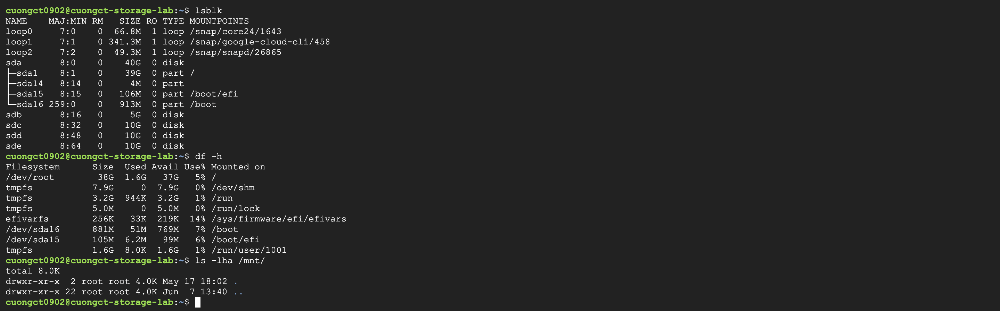

### Bước 2: Tạo Partition và định dạng Filesystem

```bash
# Tạo partition mới trên disk vừa gắn (ví dụ /dev/sdb)
sudo fdisk /dev/sdb
# [Các bước trong fdisk: 
# Nhập 'n' để tạo partition mới
#     -> Chọn 'p' -> Nhập '1' -> First Sector: Enter -> Last Sector: +1G 
#     -> Chọn 'N' -> # Nhập 'w' để lưu]


# Định dạng partition vừa tạo với filesystem ext4
sudo mkfs.ext4 /dev/sdb1
```

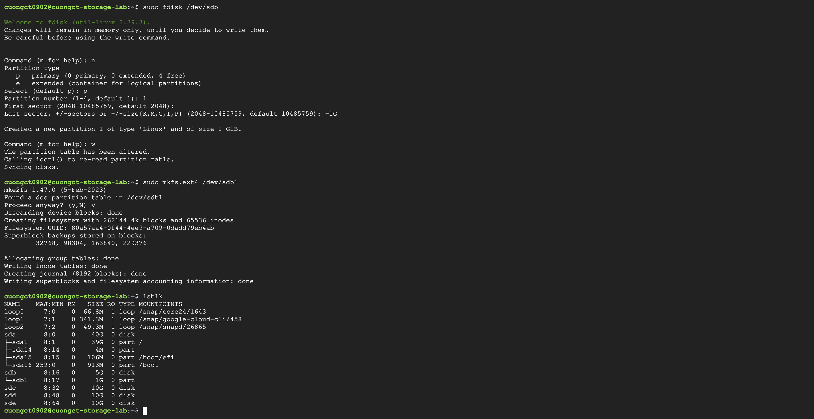
### Bước 3: Mount partition và đọc/ghi dữ liệu

```bash
# Tạo thư mục mount point
sudo mkdir -p /mnt/data

# Mount partition vào thư mục
sudo mount /dev/sdb1 /mnt/data

# Kiểm tra partition đã được mount thành công
df -h
ls -lha /mnt/
```
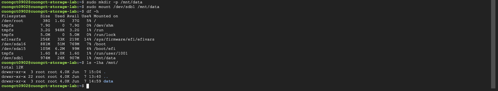


```bash
# Ghi dữ liệu vào partition
sudo tee /mnt/data/cr7_goat_mindsets.txt << 'EOF'
1. WORK ETHIC: Talent without hard work is absolutely nothing.
2. SELF-BELIEF: In my mind, I am always the best.
3. RESILIENCE: Your hate makes me completely unstoppable. SIUUU!
4. OBSESSION: Never settle for good enough, chase perfection daily.
5. GOAL: Records are made to be broken by the GOAT!
EOF

# Đọc lại dữ liệu để xác nhận
cat /mnt/data/cr7_goat_mindsets.txt

df -h | grep /mnt/data
```
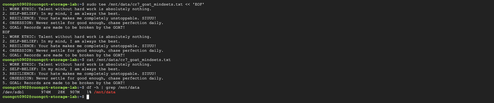

### Bước 4: Mở rộng dung lượng Partition lên 2 GB

```bash
# Mở rộng partition 1 của ổ sdb
sudo growpart /dev/sdb 1

# Tháo mount ổ đĩa
sudo umount /mnt/data

# Ép kiểm tra sửa lỗi hệ thống tệp (bắt buộc trước khi shrink)
sudo e2fsck -f /dev/sdb1

# Thu nhỏ hệ thống tệp về đúng 2G (khi đã umount thì lệnh này sẽ chạy thành công)
sudo resize2fs /dev/sdb1 2G

# Gắn (mount) lại ổ đĩa vào thư mục
sudo mount /dev/sdb1 /mnt/data

# Xoá phân vùng và 
sudo fdisk /dev/sdb
# [Các bước trong fdisk: 
# Nhập 'd' để xóa 
#     -> Nhập 'n' tạo mới 
#     -> Chọn 'p' -> Nhập '1' -> First Sector: Enter -> Last Sector: +2G 
#     -> Chọn 'N' -> # Nhập 'w' để lưu]

# Kiểm tra kết quả
df -h | grep /mnt/data
```
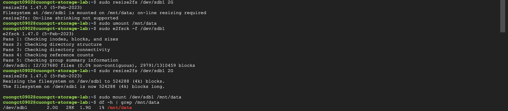
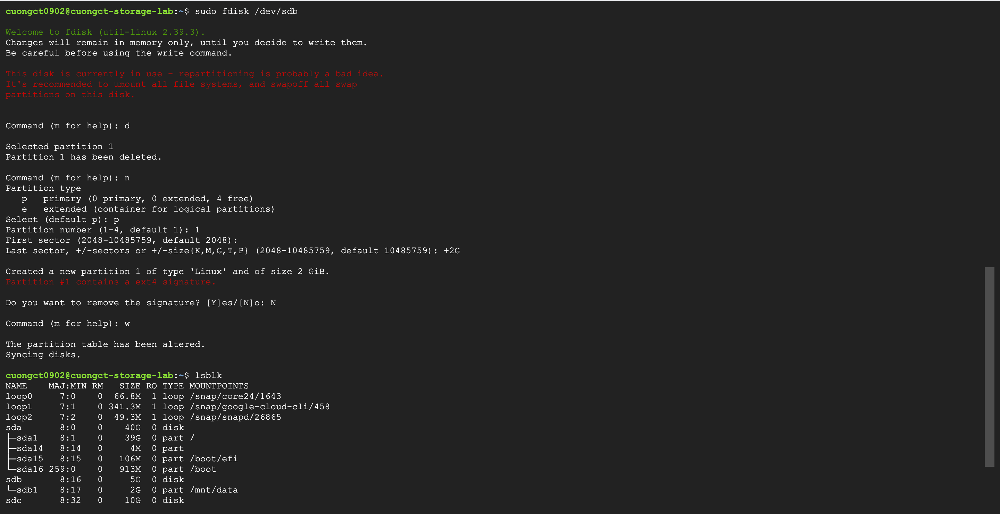

```bash
# Ghi tiếp dữ liệu sau khi mở rộng để xác nhận filesystem hoạt động bình thường
sudo tee -a /mnt/data/cr7_goat_mindsets.txt << 'EOF'
6. DISCIPLINE: Consistency is the key to staying at the top.
7. SACRIFICE: To be the best, you must sacrifice what others won't.
8. COMPETITION: I love to prove the doubters wrong every single time.
9. RECOVERY: Taking care of your body is just as important as training.
10. LEGACY: I don't follow records, the records follow me. SIUUU!
EOF

# Kiểm tra và đọc lại dữ liệu
cat /mnt/data/cr7_goat_mindsets.txt
ls -lha /mnt/data/
```
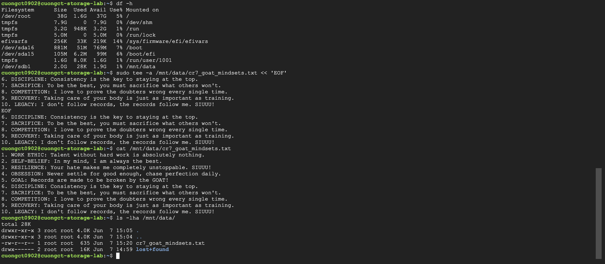


### Kết quả Phần 1

| Giai đoạn | Dung lượng | Trạng thái |
|-----------|-----------|------------|
| Khởi tạo | 1 GB | Mount thành công, đọc/ghi bình thường |
| Sau mở rộng | 2 GB | Resize thành công, đọc/ghi bình thường |


## Phần 2 — Advance: Khởi tạo Ceph Cluster

### Mục tiêu

Làm quen với Ceph CLI, trạng thái cluster, OSD và Pool thông qua việc triển khai một cụm Ceph Single-Node Lab sử dụng `cephadm`.

- **Yêu cầu 1:** Bootstrap thành công một cụm Ceph Single-Node: 1 node — 3 OSD.
- **Yêu cầu 2:** Thực hiện các lệnh kiểm tra cluster: `ceph -s`, `ceph health detail`, `ceph osd tree`, `ceph df`.
- **Kết quả cần đạt:** `Ceph health OK`.

### Môi trường

- **Hệ điều hành:** Ubuntu 24.04 LTS (Noble)
- **Nền tảng:** Google Cloud Platform (GCP)
- **Công cụ sử dụng:** `cephadm`, `ceph CLI`
- **Cấu hình phần cứng khuyến nghị:** `n2-standard-4` (4 vCPUs, 16 GB RAM)
- **Số lượng disk bổ sung:** 3 disk (dùng làm OSD), mỗi disk ~10 GB, **chưa được format**


### Bước 1: Chuẩn bị môi trường

```bash
# Cập nhật danh sách gói và nâng cấp hệ thống lên phiên bản mới nhất
sudo apt-get update && sudo apt-get upgrade -y

# Cài đặt các gói phụ thuộc bắt buộc:
# - lvm2: Cần thiết để Ceph quản lý các phân vùng ổ đĩa thô dưới dạng Logical Volumes.
# - podman/docker.io: Container engine để Cephadm khởi chạy các dịch vụ Ceph dưới dạng container.
sudo apt-get install -y python3 curl ca-certificates lvm2 podman

# Cài đặt trực tiếp cephadm từ kho lưu trữ chính thức của Ubuntu 24.04 (Noble)
sudo apt-get install -y cephadm ceph-common
```

### Bước 2: Bootstrap Ceph Cluster

```bash
# Lấy địa chỉ IP của node hiện tại
NODE_IP=$(hostname -I | awk '{print $1}')
echo "Node IP: $NODE_IP"

# Bootstrap cluster Ceph Single-Node
sudo cephadm bootstrap \
  --mon-ip $NODE_IP \
  --single-host-defaults \
  --skip-monitoring-stack
```

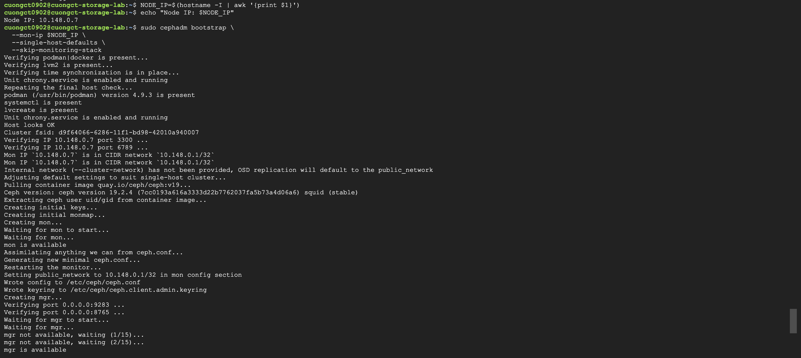

### Bước 3: Thêm 3 OSD vào Cluster

Đảm bảo 3 disk bổ sung (ví dụ `/dev/sdb`, `/dev/sdc`, `/dev/sdd`) đã được gắn vào VM và **chưa được format**.

```bash
# Kiểm tra các disk khả dụng cho OSD
sudo ceph orch device ls

# Thêm toàn bộ disk khả dụng làm OSD tự động
sudo ceph orch apply osd --all-available-devices

# Chờ khoảng 1 phút để OSD được khởi tạo, sau đó kiểm tra
sudo ceph osd tree
```
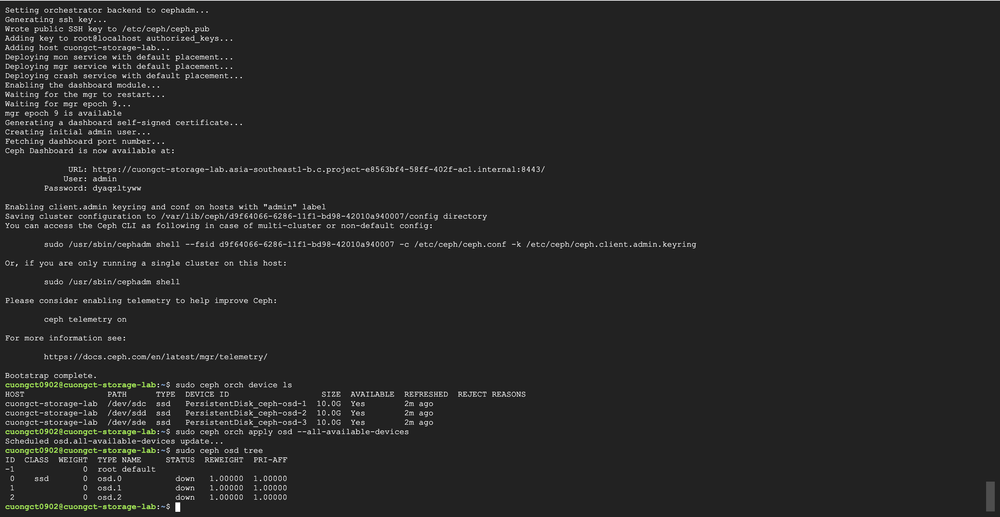

### Bước 4: Kiểm tra trạng thái Cluster

#### 4.1 Tổng quan trạng thái cluster

```bash
sudo ceph -s
```
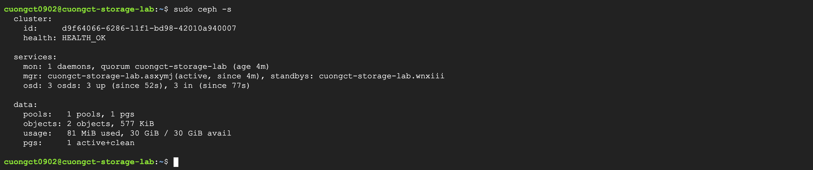

#### 4.2 Kiểm tra chi tiết

```bash
# Kiểm tra tình trạng sức khỏe
sudo ceph health detail

# Kiểm tra cấu trúc OSD
sudo ceph osd tree

# Kiểm tra dung lượng cluster và pool
sudo ceph df
```
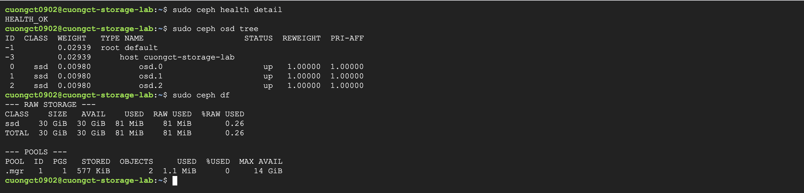

### Kết quả Phần 2

| Yêu cầu | Kết quả |
|---------|---------|
| Bootstrap Ceph Single-Node thành công | Đạt |
| Cluster có đủ 3 OSD hoạt động | Đạt |
| `ceph -s` hiển thị trạng thái cluster | Đạt |
| `ceph health detail` không có lỗi nghiêm trọng | Đạt |
| `ceph osd tree` hiển thị đủ 3 OSD | Đạt |
| `ceph df` hiển thị dung lượng pool | Đạt |
| **Ceph health OK** | **Đạt** |


## Kết luận

- Bài lab đã thực hành thành công quy trình quản lý storage cơ bản trên VM Linux: tạo, mount, đọc/ghi và mở rộng dung lượng partition mà không mất dữ liệu.
- Việc triển khai thành công Ceph Single-Node cluster với 3 OSD bằng `cephadm` cho thấy khả năng thiết lập hệ thống lưu trữ phân tán ngay trên một node đơn, phù hợp cho mục đích học tập và thử nghiệm.
- Các lệnh kiểm tra `ceph -s`, `ceph health detail`, `ceph osd tree` và `ceph df` cung cấp góc nhìn toàn diện về trạng thái, sức khỏe và tài nguyên của cluster, là nền tảng quan trọng khi vận hành Ceph trong môi trường thực tế.