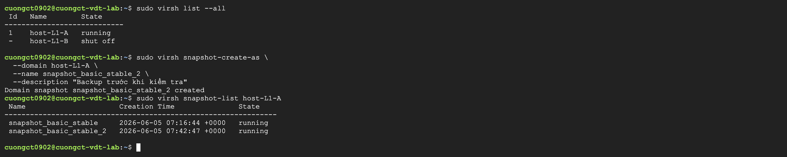
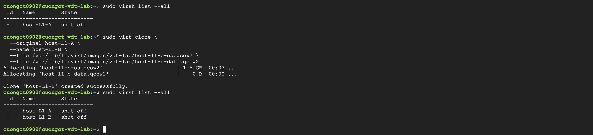
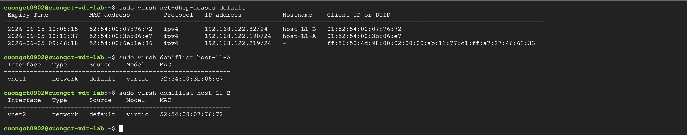
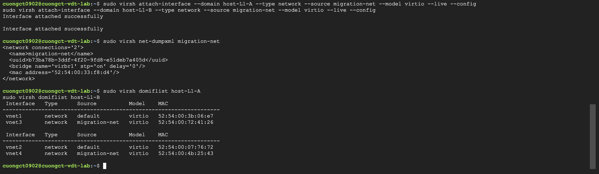
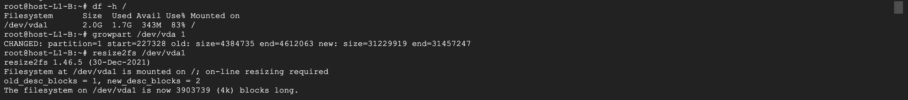
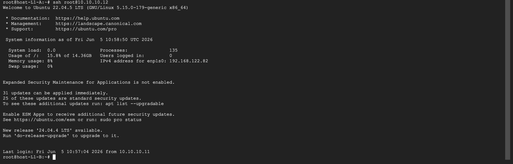
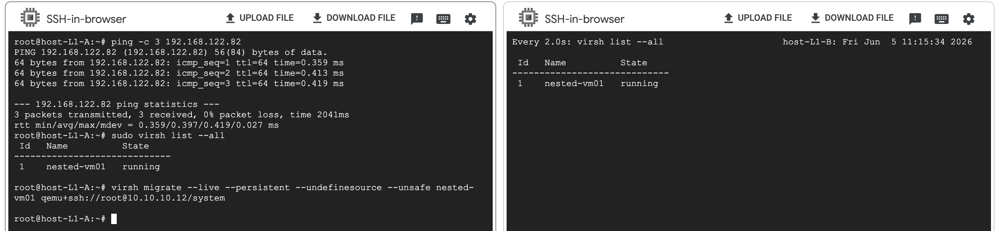
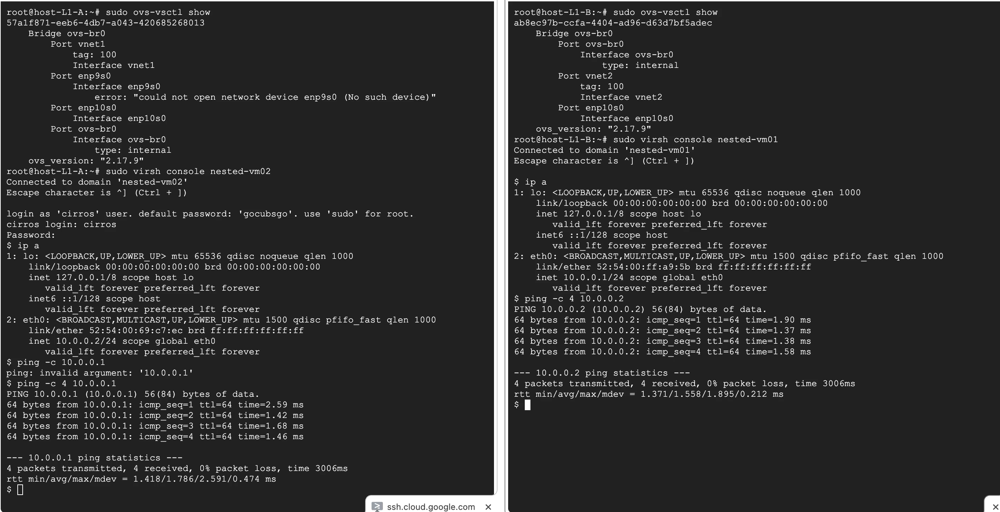

# Lab 01 - Virtualization Infrastructure with KVM/QEMU, Libvirt, OVS - VDT Cloud 2026

> Sinh viên: Đặng Tiến Cường - Đại Học Bách Khoa Hà Nội

## Yêu cầu bài tập 

- **Basic**: Sử dụng virtual machine manager hoặc virsh cli để tạo máy ảo, tạo network, start stop VM, snapshot VM, clone VM
- **Advance**: Tạo 2 VM đóng vai 2 host, tạo 1 VM trên 1 trong 2 host bằng qemu-kvm/libvirt/virsh, rồi thực hiện live migrate sang host còn lại 
- **Expert**: Dùng openvswitch trên 2 host tạo vlan network trên 2 host, tạo 2 VM trên 2 host, attach interface vlan vào 2 host và ping qua lại giữa 2 VM.


## Phần 0: Khởi Tạo Hạ Tầng L0 (Trên GCP Cloud Shell)

### 1. Tạo VM Instance có bật ảo hóa lồng (Nested Virtualization)

Chạy lệnh sau trên GCP Cloud Shell để tạo máy chủ vật lý L0:

```bash
gcloud compute instances create cuongct-vm-lab \
    --project=project-e8563bf4-58ff-402f-ac1 \
    --zone=asia-southeast1-b \
    --machine-type=n2-standard-4 \
    --network-interface=network-tier=PREMIUM,stack-type=IPV4_ONLY,subnet=default \
    --metadata=enable-osconfig=TRUE \
    --maintenance-policy=MIGRATE \
    --provisioning-model=STANDARD \
    --service-account=1058769778175-compute@developer.gserviceaccount.com \
    --scopes=https://www.googleapis.com/auth/devstorage.read_only,https://www.googleapis.com/auth/logging.write,https://www.googleapis.com/auth/monitoring.write,https://www.googleapis.com/auth/service.management.readonly,https://www.googleapis.com/auth/servicecontrol,https://www.googleapis.com/auth/trace.append \
    --create-disk=auto-delete=yes,boot=yes,device-name=cuongct-vm-lab,image=projects/ubuntu-os-cloud/global/images/ubuntu-minimal-2404-noble-amd64-v20260517,mode=rw,size=40,type=pd-balanced \
    --no-shielded-secure-boot \
    --shielded-vtpm \
    --shielded-integrity-monitoring \
    --reservation-affinity=any \
    --enable-nested-virtualization
```

### 2. SSH vào máy chủ L0 và cài đặt các gói nền tảng

```bash
# SSH vào máy L0 từ Cloud Shell
gcloud compute ssh cuongct-vdt-lab --zone=asia-southeast1-b

# Cài đặt các gói ảo hóa, SDN và Ansible
sudo apt update && sudo apt install \
    qemu-kvm libvirt-daemon-system libvirt-clients \
    virtinst virt-customize bridge-utils openvswitch-switch ansible -y

# Tải các gói cần thiết
sudo apt install iputils-ping net-tools libguestfs-tools nano vim -y
```


## Phần 1: Bài Tập Basic - Quản Trị VM Trên L0

**Mục tiêu:** Thao tác tạo, bật/tắt, nhân bản (clone) và tạo điểm khôi phục (snapshot) của máy ảo thông qua CLI.

### 1. Khởi tạo card mạng ảo mặc định của Libvirt

```bash
sudo virsh net-start default 2>/dev/null || true
sudo virsh net-autostart default 2>/dev/null || true
```

### 2. Tạo máy ảo basic-vm

```bash
# Tạo thư mục quản lý storage tập trung
sudo mkdir -p /var/lib/libvirt/images/vdt-lab

# Chuẩn bị image hệ điều hành cho host L1
sudo wget -P /var/lib/libvirt/images/vdt-lab/ https://cloud-images.ubuntu.com/jammy/current/jammy-server-cloudimg-amd64.img

# Tạo ổ đĩa OS (Sử dụng đĩa gốc làm backing)
sudo qemu-img create -f qcow2 -F qcow2 -b /var/lib/libvirt/images/vdt-lab/jammy-server-cloudimg-amd64.img /var/lib/libvirt/images/vdt-lab/host-l1-a-os.qcow2 15G

# Tạo ổ đĩa Data (Ổ trắng hoàn toàn, chuẩn bị cho bài Advance làm NFS)
sudo qemu-img create -f qcow2 /var/lib/libvirt/images/vdt-lab/host-l1-a-data.qcow2 10G

# Đảm bảo máy L0 đã có SSH Key
ssh-keygen -t rsa -N "" -f ~/.ssh/id_rsa

# Đặt pass root và cấu hình tự nhận DHCP mạng default cho file đĩa của Host A
sudo virt-customize -a /var/lib/libvirt/images/vdt-lab/host-l1-a-os.qcow2 \
  --hostname host-L1-A \
  --root-password password:123456 \
  --write /etc/netplan/01-netcfg.yaml:$'network:\n  version: 2\n  ethernets:\n    enp1s0:\n      dhcp4: true\n      dhcp-identifier: mac' \
  --edit '/etc/ssh/sshd_config:s/#PermitRootLogin.*/PermitRootLogin yes/' \
  --edit '/etc/ssh/sshd_config:s/PasswordAuthentication yes/PasswordAuthentication yes/' \
  --ssh-inject root:file:/home/cuongct0902/.ssh/id_rsa.pub \
  --run-command 'ssh-keygen -A'

# Tạo VM (bao gồm cả 2 ổ cứng và bật nested virtualization)
sudo virt-install \
  --name host-L1-A \
  --ram 4096 \
  --vcpus 2 \
  --cpu host-passthrough \
  --disk path=/var/lib/libvirt/images/vdt-lab/host-l1-a-os.qcow2,device=disk,bus=virtio \
  --disk path=/var/lib/libvirt/images/vdt-lab/host-l1-a-data.qcow2,device=disk,bus=virtio \
  --network network=default \
  --os-variant ubuntu22.04 \
  --graphics none \
  --import \
  --noautoconsole
```

### 3. Các lệnh điều khiển máy ảo

```bash
# Kiểm tra trạng thái máy ảo
sudo virsh list --all

# Bật máy ảo
sudo virsh start host-L1-A

# Tắt an toàn (Shutdown) hoặc cưỡng bức (Destroy)
sudo virsh shutdown host-L1-A
sudo virsh destroy host-L1-A

# Xoá máy ảo
sudo virsh undefine host-L1-A --remove-all-storage
```

### 4. Tạo Snapshot

```bash
# Tạo điểm khôi phục
sudo virsh snapshot-create-as \
  --domain host-L1-A \
  --name snapshot_basic_stable \
  --description "Backup trước khi kiểm tra"

# Liệt kê danh sách Snapshot
sudo virsh snapshot-list host-L1-A

# Khôi phục về Snapshot đã lưu
sudo virsh snapshot-revert host-L1-A snapshot_basic_stable

# Xoá snapshort đã lưu
sudo virsh snapshot-delete host-L1-A snapshot_basic_stable_2
```


### 5. Clone VM

```bash
# Máy ảo gốc phải được tắt trước khi clone để đảm bảo toàn vẹn dữ liệu
sudo virsh shutdown host-L1-A
sudo virsh destroy host-L1-A 2>/dev/null || true

# Tiến hành nhân bản thành Host L1-B
sudo virt-clone \
  --original host-L1-A \
  --name host-L1-B \
  --file /var/lib/libvirt/images/vdt-lab/host-l1-b-os.qcow2 \
  --file /var/lib/libvirt/images/vdt-lab/host-l1-b-data.qcow2

# Sửa hostname và reset bộ nhận diện SSH server để tránh xung đột 
sudo virt-customize -a /var/lib/libvirt/images/vdt-lab/host-l1-b-os.qcow2 \
  --hostname host-L1-B \
  --run-command 'rm -f /etc/ssh/ssh_host_* && ssh-keygen -A'

# Bật lại hai con host VM L1
sudo virsh start host-L1-A
sudo virsh start host-L1-B
sudo virsh dhcp-net-leases default
```



## Phần 2: Bài Tập Advance - Máy Ảo Lồng Nhau và Live Migration

- **Mục tiêu**: Thiết lập cấu hình liên thông mạng chuyên dụng và Shared Storage giữa hai Host L1 (host-L1-A và host-L1-B), sau đó khởi tạo một máy ảo con L2 trên Host A và tiến hành di trú nóng (Live Migration) sang Host B mà không làm mất trạng thái hoạt động.

- __Trạng thái hệ thống__ trước khi thực hiện: Cả 2 Host L1 đều đang ở trạng thái running, sở hữu 1 card mạng nối vào mạng quản trị default và có ổ cứng phụ 10G hoàn toàn trống.



## 1. Cấu hình hạ tầng mạng và hot-plug trên máy host L0

```plaintext
==========================================================================================
                               MÁY CHỦ VẬT LÝ L0 (GCP INSTANCE)
                          Mạng default của L0 (Dải 192.168.122.x)
                                             |
                      +----------------------+----------------------+
                      | (Cắm vào Switch ảo virbr0 ở L0)             |
                      |                                             |
            (IP: 192.168.122.190)                         (IP: 192.168.122.82)
              Card: enp1s0                                  Card: enp1s0
         +-----------------------+                     +-----------------------+
         |      HOST L1-A        |                     |      HOST L1-B        |
         |     (NFS Server)      |                     |     (NFS Client)      |
         |                       |                     |                       |
         |  [Ổ cứng vdb 10G]     |                     |                       |
         |         |             |                     |                       |
         |  /mnt/shared-storage  |                     |  /mnt/shared-storage  |
         |  (Chứa nested-vm01)   |                     |  (Mount NFS sang A)   |
         |         |             |                     |           ^           |
         |         +=============X=== ĐƯỜNG MẠNG NFS ==X===========+           |
         |                       |                     |                       |
         |  Card: enp8s0         |                     |  Card: enp8s0         |
         |  (IP: 10.10.10.11)    |                     |  (IP: 10.10.10.12)    |
         +-----------X-----------+                     +-----------X-----------+
                     |                                             |
                     +--------------- migration-net --------------+
                               (Switch ảo virbr1 ở L0)
                                         ||
                                         ||
             [nested-vm01]               ||  MIGRATION FLOW
             Trạng thái: RUNNING         ||  (Bơm bộ nhớ RAM)
             Memory: 512MB ------------->=============>>>>>>> [nested-vm01]
                                                             (Bay sang Host B)
==========================================================================================
```

Để phục vụ cho việc truyền tải dữ liệu đĩa ảo và bộ nhớ RAM với tốc độ cao, ta tiến hành tạo một mạng cô lập chuyên dụng (migration-net) và gắn nóng card mạng này vào 2 Host L1 mà không cần tắt máy.

```bash
# Dùng vim tạo file cấu hình mạng ảo migration
vim /tmp/migration-net.xml

# Dán và lưu cấu hình sau
<network>
  <name>migration-net</name>
  <bridge name='virbr1' stp='on' delay='0'/>
</network>


# Kích hoạt mạng migration-net
sudo virsh net-define /tmp/migration-net.xml
sudo virsh net-start migration-net
sudo virsh net-autostart migration-net

# Hot-plug (Gắn nóng) Card mạng thứ 2 vào 2 Host L1 đang chạy
sudo virsh attach-interface --domain host-L1-A --type network --source migration-net --model virtio --live --config
sudo virsh attach-interface --domain host-L1-B --type network --source migration-net --model virtio --live --config

# Kiểm tra trạng thái của mạng ảo
sudo virsh net-dumpxml migration-net

# Kiểm tra card mạng đã được gắn
sudo virsh domiflist host-L1-A
sudo virsh domiflist host-L1-B
```



### 3. Cấu hình tự động hoá trên 2 Host VM L1 

Sau khi cắm nóng card mạng ở L0, ta tiến hành cấu hình IP tĩnh cho dải mạng Migration, phân giải tên miền, thiết lập kết nối không mật khẩu và dựng cấu hình Shared Storage thông qua NFS bằng cách sử dụng ổ đĩa Data 10G sẵn có.


#### Chuẩn bị môi trường L1

Bản Ubuntu Cloud Image mặc định khi tải về chỉ có dung lượng phân vùng gốc (`/`) khoảng 2GB. Ở Phần 1, dù ta đã dùng lệnh `qemu-img create ... 15G` để tạo ổ đĩa ảo, nhưng đó mới chỉ là phóng to lớp vỏ phần cứng ảo hóa bên ngoài. Hệ điều hành Ubuntu bên trong chưa hề thực hiện mở rộng (resize) phân vùng hệ thống để ăn hết 15GB đó.



```bash
# 1. Cập nhật package list và cài các gói ảo hóa, mạng nền tảng cho Host L1-A
ssh root@192.168.122.190

# Ép phân vùng ảo nuốt hết dung lượng của đĩa cứng
df growpart /dev/vda 1

# Mở rộng hệ thống File System của phân vùng /
resize2fs /dev/vda1

# Kiểm tra lại dung lượng và cài đặt (Mục / phải hiển thị trống thênh thang khoảng ~13-14G)
df -h /
apt update && apt install -y qemu-kvm libvirt-daemon-system libvirt-clients virtinst openvswitch-switch bridge-utils

# Làm tương tự với Host L1-B
ssh root@192.168.122.82
df growpart /dev/vda 1
resize2fs /dev/vda1
df -h /
apt update && apt install -y qemu-kvm libvirt-daemon-system libvirt-clients virtinst openvswitch-switch bridge-utils
```

#### Cấu hình trên Host L1-A (Đóng vai trò NFS Server)

Ta sẽ biến ổ cứng phụ 10G (`/dev/vdb`) của Host A thành một phân vùng mạng chia sẻ, đồng thời đặt IP tĩnh `10.10.10.11` cho card mạng thứ hai vừa được hot-plug.

```bash
# -- 1. Cấu hình netplan --
# Lưu ý quan trọng: Trước khi cấu hình, bắt buộc phải chạy lệnh `sudo ip a` để kiểm tra 
# tên card mạng thứ 2 vừa được hot-plug vào hệ thống. Tên card mạng có thể thay đổi 
# tùy theo khe cắm PCI được cấp phát (ví dụ: enp2s0, enp7s0, enp8s0, eth1,...).
# Ở đây, hệ thống thực tế đang nhận diện card thứ hai là 'enp8s0'.
#
# - Card enp1s0: Giữ nguyên DHCP để kết nối mạng default (Quản trị/Internet từ L0).
# - Card enp8s0: Tắt DHCP, cấu hình IP tĩnh dải 10.10.10.x phục vụ riêng cho Live Migration.

cat << 'EOF' > /etc/netplan/01-netcfg.yaml
network:
  version: 2
  ethernets:
    enp1s0:
      dhcp4: true
      dhcp-identifier: mac
    enp8s0:
      dhcp4: false
      addresses:
        - 10.10.10.11/24
EOF

chmod 600 /etc/netplan/01-netcfg.yaml
netplan apply

# -- 2. Cấu hình file danh bạ nội bộ --
# - Mục đích: Thiết lập DNS cục bộ giữa 2 Hypervisor L1.
# - Vai trò: 
#   1. Giúp Libvirt xác thực danh tính (Hostname Verification) giữa 2 Node khi bắt tay Migration.
#   2. Ép luồng dữ liệu đồng bộ bộ nhớ RAM của VM L2 phải đi qua card mạng chuyên dụng 
#      mạng Migration (10.10.10.x), tránh làm nghẽn hoặc sập đường truyền quản trị (192.168.122.x)
echo -e "10.10.10.11 host-L1-A\n10.10.10.12 host-L1-B" >> /etc/hosts

# -- 3. Định dạng và tạo thư mục lưu trữ chung trên ổ 10G (/dev/vdb) --
# Định dạng ổ cứng sang ext4
mkfs.ext4 -F /dev/vdb

# Tạo thư mục mount và tiến hành kết nối ổ đĩa
mkdir -p /mnt/shared-storage
mount /dev/vdb /mnt/shared-storage

# Cấp quyền tối cao cho định danh Libvirt truy cập đĩa ảo sâu bên trong
chown -R libvirt-qemu:kvm /mnt/shared-storage
chmod 777 /mnt/shared-storage

# -- 4. Dựng dịch vụ NFS Server để chia sẻ thư mục này sang Host B --
# Cài đặt gói dịch vụ NFS Server
apt install -y nfs-kernel-server

# Khai báo cấu hình export (Cho phép dải mạng 10.10.10.0/24 đọc và ghi dữ liệu với quyền root)
echo "/mnt/shared-storage 10.10.10.0/24(rw,sync,no_subtree_check,no_root_squash)" >> /etc/exports

# Khởi động lại dịch vụ để ăn cấu hình
systemctl restart nfs-kernel-server

# -- 5. Tạo khóa SSH nội bộ để chuẩn bị liên thông Hypervisor --
ssh-keygen -t rsa -N "" -f ~/.ssh/id_rsa
```

#### Cấu hình trên Host L1-B (Đóng vai trò NFS Client)

Host B cần cấu hình mạng Migration với IP tĩnh `10.10.10.12` và thực hiện kết nối (mount) từ xa vào thư mục NFS mà Host A đang chia sẻ.


```bash
cat << 'EOF' > /etc/netplan/01-netcfg.yaml
network:
  version: 2
  ethernets:
    enp1s0:
      dhcp4: true
      dhcp-identifier: mac
    enp8s0:
      dhcp4: false
      addresses:
        - 10.10.10.12/24
EOF

chmod 600 /etc/netplan/01-netcfg.yaml
netplan apply

# -- 2. Cấu hình file danh bạ nội bộ /etc/hosts --
echo -e "10.10.10.11 host-L1-A\n10.10.10.12 host-L1-B" >> /etc/hosts

# -- 3. Cài đặt NFS Client và gắn kết vào ổ đĩa chung của Host A
# Cài gói kết nối NFS từ xa
apt install -y nfs-common

# Tạo thư mục đồng bộ tên với Host A
mkdir -p /mnt/shared-storage

# Lệnh mount trực tiếp qua đường mạng nội bộ 10G
mount -t nfs 10.10.10.11:/mnt/shared-storage /mnt/shared-storage

# Phân quyền đồng bộ cho Libvirt bên Host B
chown -R libvirt-qemu:kvm /mnt/shared-storage

# -- 4. Kiểm tra và sửa cấu hình SSH Server (Fix lỗi Permission Denied do Cloud-Image drop-in)
# Liệt kê các file cấu hình mở rộng để kiểm tra sự tồn tại của file ghi đè (ví dụ: 50-cloudimg-settings.conf)
ls /etc/ssh/sshd_config.d/

# Dùng sed ép cấu hình cho phép Root đăng nhập bằng mật khẩu ở file chính
sudo sed -i 's/^PasswordAuthentication no/PasswordAuthentication yes/' /etc/ssh/sshd_config
sudo sed -i 's/^PermitRootLogin.*/PermitRootLogin yes/' /etc/ssh/sshd_config

# Bắt buộc ép cấu hình ghi đè tương tự cho toàn bộ file con trong thư mục sshd_config.d/
sudo sed -i 's/^PasswordAuthentication no/PasswordAuthentication yes/' /etc/ssh/sshd_config.d/*.conf 2>/dev/null || true
sudo sed -i 's/^PermitRootLogin.*/PermitRootLogin yes/' /etc/ssh/sshd_config.d/*.conf 2>/dev/null || true

# Khởi động lại dịch vụ SSH để áp dụng toàn bộ thay đổi
sudo systemctl restart sshd
```

#### Thiết lập SSH Trust 
Để lệnh `virsh migrate` chạy mượt mà không bị ngắt quãng giữa chừng đòi hỏi mật khẩu, hai Hypervisor phải tin tưởng nhau qua SSH Key. Quay lại Terminal của Host L1-A, chạy lệnh truyền khóa công khai sang Host B:

```bash
ssh-copy-id root@10.10.10.12
```

Khi hệ thống yêu cầu nhập mật khẩu `123456` và thực hiện thử nghiệm `ssh root@10.10.10.12`, nếu vào được Host L1-B thì đường ống ssh giữa 2 host đã thông. 



### 4. Thực hiện Live Migration thủ công

#### Khởi tạo máy ảo con L2 trên Host L1-A

Quay lại cửa sổ điều khiển của Host L1-A, tiến hành dựng máy ảo `nested-vm01`. Điểm mấu chốt là vị trí lưu trữ file đĩa đệm bắt buộc phải nằm trên phân vùng NFS chung để cả hai Hypervisor cùng nhìn thấy dữ liệu cấu trúc.

```bash
# SSH vào Host A từ máy L0 (Nếu chưa kết nối)
ssh root@192.168.122.190

# Khởi chạy lệnh tạo máy ảo L2 nằm trên Shared Storage
virt-install \
  --name nested-vm01 \
  --ram 512 \
  --vcpus 1 \
  --disk path=/mnt/shared-storage/nested-vm01.qcow2,size=2,bus=virtio,format=qcow2 \
  --network network=default,model=virtio \
  --graphics none \
  --pxe \
  --noautoconsole \
  --os-variant generic

# Kiểm tra đảm bảo máy ảo L2 đang ở trạng thái 'running'
virsh list --all
```

#### Thực hiện Live Migration

Để kiểm tra quá trình dịch chuyển bộ nhớ RAM một cách trực quan, tại cửa sổ Terminal của Host L1-B (`192.168.122.82`), ta bật lệnh theo dõi trạng thái thời gian thực:

```bash
watch virsh list --all
```

Tại cửa sổ Terminal của Host L1-A, ta thực thi lệnh kích hoạt Live Migration xuyên không qua mạng chuyên dụng `10.10.10.x`:
```bash
virsh migrate --live --persistent --undefinesource --unsafe \
  nested-vm01 qemu+ssh://root@10.10.10.12/system
```

VM được migrate thành công sang Host L1-B với trạng thái running: 




## Phần 3: Bài Tập Expert - Mạng SDN Trunking với Open vSwitch

```plaintext
======================================================================================================
                                    🖥️ MÁY CHỦ VẬT LÝ L0 (GCP INSTANCE)
======================================================================================================
                                                  
                       +------------------------------------------------------+
                       |  Switch trung gian tầng L0: virbr2 (ovs-trunk-net)   |
                       |  (Đã tắt Iptables & vlan_filtering=0)                |
                       +---------+----------------------------------+---------+
                                 | ⬆️ (3) Gói tin mang thẻ VLAN 100 ⬇️ (4)
                       [Cổng ảo L0: vnet11]               [Cổng ảo L0: vnet12]
                                 |                                  |
                                 |                                  |
============[ HOST L1-A ]========+============    ============[ HOST L1-B ]========+============
                                 |                                                 |
                      [Card vật lý L1: enp10s0]                         [Card vật lý L1: enp10s0] 
                      (Cổng Trunking xuất ra L0)                        (Cổng Trunking xuất ra L0)
                                 |                                                 |
                       +---------+---------+                             +---------+---------+
                       | Switch ảo ovs-br0 |                             | Switch ảo ovs-br0 |
                       +---------+---------+                             +---------+---------+
                                 |                                                 |
                       [Cổng ảo L1: vnet1]                               [Cổng ảo L1: vnet2]
                          (Access Port)                                     (Access Port)
                                 | ⬆️ (2) OVS đóng gói                          | ⬇️ (5) OVS lột bỏ 
                                 |    thêm thẻ VLAN 100                         |    thẻ VLAN 100
                                 |                                                 |
======[ VM L2 (nested-vm02) ]====+============    ======[ VM L2 (nested-vm01) ]====+============
                                 |                                                 |
                          [Card VM: eth0]                                   [Card VM: eth0]
                           IP: 10.0.0.2                                      IP: 10.0.0.1
                                 |                                                 |
         (1) Ping 10.0.0.1       |                                                 |       (6) Nhận gói tin ICMP
       [ Gói tin Thuần/Untagged ]+                                                 +------[ Gói tin Thuần/Untagged ]
```

**Mục tiêu:** Xây dựng hạ tầng mạng Software-Defined Networking (SDN) sử dụng Open vSwitch (OVS). Theo Best Practice về kiến trúc, để đảm bảo tính khả dụng cao (HA) và tránh gây kẹt I/O cho hệ thống lưu trữ NFS hiện tại, ta sẽ tạo thêm một card mạng thứ 3 hoàn toàn độc lập làm đường Layer-2 Trunk. Tại các Host L1, card này sẽ được giao cho OVS độc chiếm để vận chuyển luồng dữ liệu gắn Tag VLAN 100 cô lập giữa hai máy ảo L2 (`nested-vm01` và `nested-vm02`).

### 3.1. Chuẩn bị đường cáp Trunking từ máy vật lý L0

Đứng tại máy L0 (`cuongct-vdt-lab`), ta tạo một mạng Isolated mới tinh (`ovs-trunk-net`) sử dụng bridge `virbr2` và cắm nóng vào 2 Host L1.

**Bước quan trọng (Vượt rào Iptables):** Mặc định Kernel của máy L0 sẽ dùng Iptables để chặn các gói tin có mang thẻ VLAN chạy xuyên qua Bridge. Ta cần tắt tính năng lọc này trước khi tạo mạng.

```bash
# 1. Vô hiệu hóa Netfilter can thiệp vào Bridge Layer 2 trên L0
sudo sysctl -w net.bridge.bridge-nf-call-iptables=0
sudo sysctl -w net.bridge.bridge-nf-call-arptables=0
sudo sysctl -w net.bridge.bridge-nf-call-ip6tables=0

# 2. Tạo file XML định nghĩa mạng SDN cô lập
cat << 'EOF' > /tmp/ovs-trunk-net.xml
<network>
  <name>ovs-trunk-net</name>
  <bridge name='virbr2' stp='on' delay='0'/>
</network>
EOF

# 3. Định nghĩa, kích hoạt và cho phép tự động chạy
sudo virsh net-define /tmp/ovs-trunk-net.xml
sudo virsh net-start ovs-trunk-net
sudo virsh net-autostart ovs-trunk-net

# 4. Cắm nóng (hot-plug) card mạng này vào 2 Host L1 đang chạy
sudo virsh attach-interface --domain host-L1-A --type network --source ovs-trunk-net --model virtio --live --config
sudo virsh attach-interface --domain host-L1-B --type network --source ovs-trunk-net --model virtio --live --config
```

> ⚠️ **Lưu ý cực kỳ quan trọng:** Sau khi cắm nóng, bắt buộc phải SSH vào từng Host L1 và gõ lệnh `sudo ip a` để kiểm tra tên card mạng thứ 3 vừa xuất hiện. Trong kịch bản này, card mới tên là **`enp10s0`** (bạn hãy thay thế tên tương ứng với máy của mình nếu nó là `enp9s0` hoặc tên khác). Tuyệt đối không đụng chạm đến card chạy mạng NFS.


### 3.2. Thao Tác Trên Host L1-B - Cấu hình OVS & Tái tạo VM01

Host L1-B hiện tại đang chứa máy ảo rỗng (PXE boot) từ phần trước. Ta sẽ dọn dẹp nó, cấu hình OVS và dựng lại một máy ảo L2 hoàn chỉnh bằng **CirrOS** (hệ điều hành tối ưu cho Cloud/SDN).

```bash
# 1. SSH vào Host B từ máy L0
ssh root@192.168.122.82

# 2. Khởi tạo một Virtual Switch bằng Open vSwitch
sudo ovs-vsctl add-br ovs-br0

# 3. Gộp card mạng Trunking (VD: enp10s0) vào Switch ảo này và bật nguồn
sudo ovs-vsctl add-port ovs-br0 enp10s0
sudo ip link set ovs-br0 up
sudo ip link set enp10s0 up

# 4. Định nghĩa mạng OVS cho Libvirt
cat << 'EOF' > /tmp/ovs-net.xml
<network>
  <name>ovs-network</name>
  <forward mode='bridge'/>
  <bridge name='ovs-br0'/>
  <virtualport type='openvswitch'/>
</network>
EOF
sudo virsh net-define /tmp/ovs-net.xml
sudo virsh net-start ovs-network
sudo virsh net-autostart ovs-network

# 5. Hủy máy ảo rỗng cũ và Tải Image CirrOS (15MB)
sudo virsh destroy nested-vm01 2>/dev/null || true
sudo virsh undefine nested-vm01 2>/dev/null || true
sudo wget -q https://download.cirros-cloud.net/0.6.2/cirros-0.6.2-x86_64-disk.img -O /var/lib/libvirt/images/cirros-vm01.qcow2

# 6. Dựng máy ảo L2 mới với CirrOS
sudo virt-install \
  --name nested-vm01 \
  --ram 512 \
  --vcpus 1 \
  --disk path=/var/lib/libvirt/images/cirros-vm01.qcow2,format=qcow2 \
  --network network=ovs-network,model=virtio \
  --graphics none \
  --noautoconsole \
  --import \
  --os-variant generic

```

#### Cấu hình gán Tag VLAN 100 cho `nested-vm01`

Chạy lệnh `virsh edit nested-vm01`, tìm khối `<interface>` và bổ sung thẻ tag cô lập:

```xml
<interface type='network'>
  <source network='ovs-network'/>
  <vlan>
    <tag id='100'/>
  </vlan>
  <model type='virtio'/>
</interface>

```

*Reboot lại máy ảo để áp dụng Tag:*

```bash
sudo virsh destroy nested-vm01 && sudo virsh start nested-vm01

```

#### Đăng nhập Console VM01 đặt IP mạng SDN (10.0.0.1)

```bash
sudo virsh console nested-vm01

```

> * **Lưu ý:** Chờ khoảng 1-2 phút cho đến khi dịch vụ `cloud-init` đếm timeout (20/20) xong và hiện chữ `cirros login:`.
> * **User:** `cirros` | **Pass:** `gocubsgo`
> 
> 

Vào dấu nhắc lệnh, gõ cụm cấu hình IP tĩnh:

```bash
sudo killall dhcpcd 2>/dev/null || true
sudo ip addr flush dev eth0
sudo ip addr add 10.0.0.1/24 dev eth0
sudo ip link set eth0 up

```

*(Bấm `Ctrl + ]` để thoát về Host L1-B, sau đó `exit` về L0).*


### 3.3. Thao Tác Trên Host L1-A - Cấu hình OVS & Tạo VM02

Quay trở lại Host A, thiết lập cấu trúc hạ tầng OVS tương đương.

```bash
# 1. SSH vào Host A từ máy L0
ssh root@192.168.122.190

# 2. Khởi tạo Switch OVS và gộp card Trunking (VD: enp10s0)
sudo ovs-vsctl add-br ovs-br0
sudo ovs-vsctl add-port ovs-br0 enp10s0
sudo ip link set ovs-br0 up
sudo ip link set enp10s0 up

# 3. Định nghĩa mạng ovs-network cho Libvirt (Tương tự Host B)
cat << 'EOF' > /tmp/ovs-net.xml
<network>
  <name>ovs-network</name>
  <forward mode='bridge'/>
  <bridge name='ovs-br0'/>
  <virtualport type='openvswitch'/>
</network>
EOF
sudo virsh net-define /tmp/ovs-net.xml
sudo virsh net-start ovs-network
sudo virsh net-autostart ovs-network

# 4. Tải Image CirrOS và Khởi tạo VM02
sudo wget -q https://download.cirros-cloud.net/0.6.2/cirros-0.6.2-x86_64-disk.img -O /var/lib/libvirt/images/cirros-vm02.qcow2

sudo virt-install \
  --name nested-vm02 \
  --ram 512 \
  --vcpus 1 \
  --disk path=/var/lib/libvirt/images/cirros-vm02.qcow2,format=qcow2 \
  --network network=ovs-network,model=virtio \
  --graphics none \
  --noautoconsole \
  --import \
  --os-variant generic
```

#### Gán Tag VLAN 100 và Đặt IP cho `nested-vm02`

* Chạy `virsh edit nested-vm02` và gán VLAN 100 tương tự Host B.
* Reboot máy ảo: `sudo virsh destroy nested-vm02 && sudo virsh start nested-vm02`
* Vào Console: `sudo virsh console nested-vm02` (Đợi cloud-init, đăng nhập `cirros`/`gocubsgo`).

```bash
sudo killall dhcpcd 2>/dev/null || true
sudo ip addr flush dev eth0
sudo ip addr add 10.0.0.2/24 dev eth0
sudo ip link set eth0 up
```

### 3.4. Nghiệm thu & Chốt hạ (Ping Test L2)

Từ giao diện Console của máy ảo `nested-vm02` (Host A), tiến hành gửi gói tin ICMP xuyên qua hệ thống SDN lồng nhau để kiểm tra thông mạch với `nested-vm01` (Host B):



**Kết quả mong đợi:** Gói tin đi thành công, chứng minh đường hầm OVS VLAN 100 xuyên qua Trunking L0 đã hoạt động hoàn hảo.